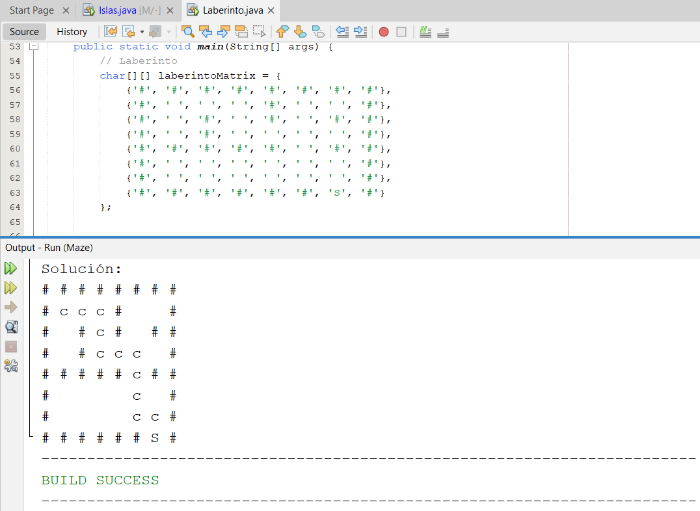
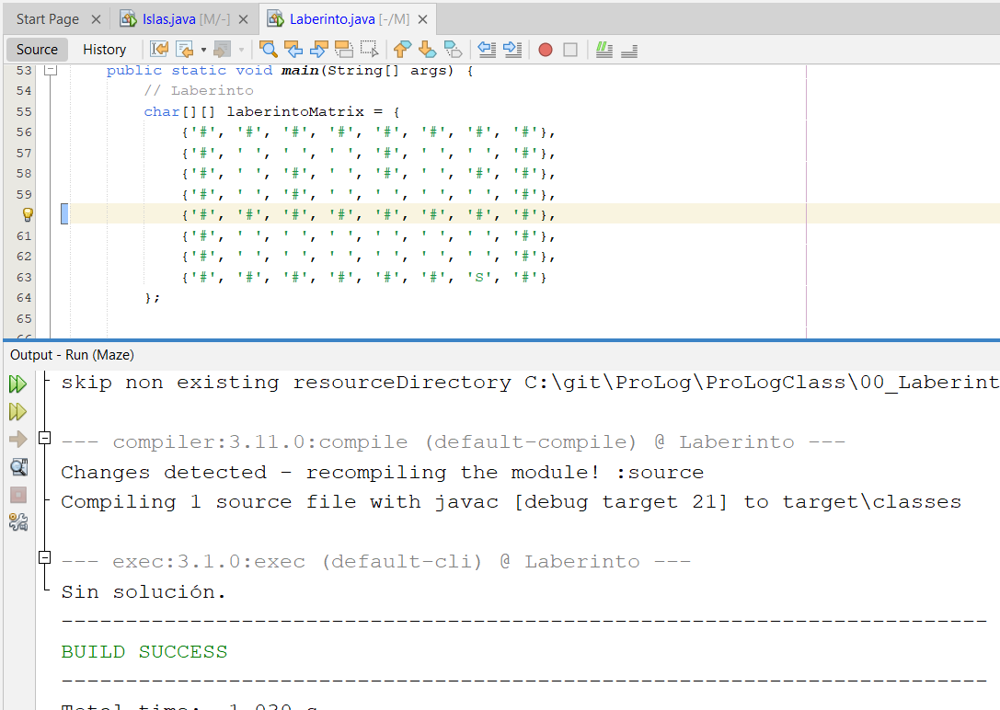

<p style="text-align: right;"><em>DATE: JANUARY - JUNE 2024</em></p>

## **MAZE EXERCISE**
### Made In: JAVA


#### Activity number: 01

#### **DESCRIPTION:**
#### This Java program solves a maze using backtracking. It defines a maze with walls (#), empty spaces ( ), and a "salida" point (S). It recursively tries to move in all directions until it finds the exit. If successful, it prints the solution; otherwise, it indicates there's no solution."
________________________________________________________
________________________________________________________
#### Student: José López Lara
#### Control Number: 19120194
* [x] Student Email: l19120194@morelia.tecnm.mx
* [x] Personal Email: jose.lopez.lara.cto@gmail.com
* [x] GitHub Profile: [JoseLopezLara](https://github.com/JoseLopezLara)
* [x] Linkedin Profile: [in/jose-lopez-lara/](https://www.linkedin.com/in/jose-lopez-lara/) 
_______________________________________________________
_______________________________________________________

### **CODE:**

```java
public class Laberinto {
    private char[][] laberinto;

    public Laberinto(char[][] laberinto) {
        this.laberinto = laberinto;
    }

    public boolean buscarCamino(int x, int y) {
        if (laberinto[x][y] == 'S') {
            return true;
        }

        if (x >= 0 && x < laberinto.length && y >= 0 && y < laberinto[0].length && laberinto[x][y] == ' ') {
            // Dejar semilla
            laberinto[x][y] = 'c';

            // Intentar moverse en todas las direcciones
            if (buscarCamino(x + 1, y) || 
                buscarCamino(x - 1, y) || 
                buscarCamino(x, y + 1) || 
                buscarCamino(x, y - 1)) {
                return true;
            }

            // Si no hay salida, regresar y desmarcar
            laberinto[x][y] = ' ';
        }

        return false;
    }

  

    public void imprimirLaberinto() {
        for (char[] row : laberinto) {
            for (char cell : row) {
                System.out.print(cell + " ");
            }
            System.out.println();
        }
    }

    public static void main(String[] args) {
        // Laberinto
        char[][] laberintoMatrix = {
            {'#', '#', '#', '#', '#', '#', '#', '#'},
            {'#', ' ', ' ', ' ', '#', ' ', ' ', '#'},
            {'#', ' ', '#', ' ', '#', ' ', '#', '#'},
            {'#', ' ', '#', ' ', ' ', ' ', ' ', '#'},
            {'#', '#', '#', '#', '#', ' ', '#', '#'},
            {'#', ' ', ' ', ' ', ' ', ' ', ' ', '#'},
            {'#', ' ', ' ', ' ', ' ', ' ', ' ', '#'},
            {'#', '#', '#', '#', '#', '#', 'S', '#'}
        };

        
        Laberinto lab = new Laberinto(laberintoMatrix);

        // Buscar el camino desde la POSICIÓN INICIAL (1, 1)
        if (lab.buscarCamino(1, 1)) {
            System.out.println("Solución:");
            lab.imprimirLaberinto();
        } else {
            System.out.println("Sin solución.");
        }
    }
}

```


### **TESTS:**
- ### **Test 1:**


- ### **Test 2:**
