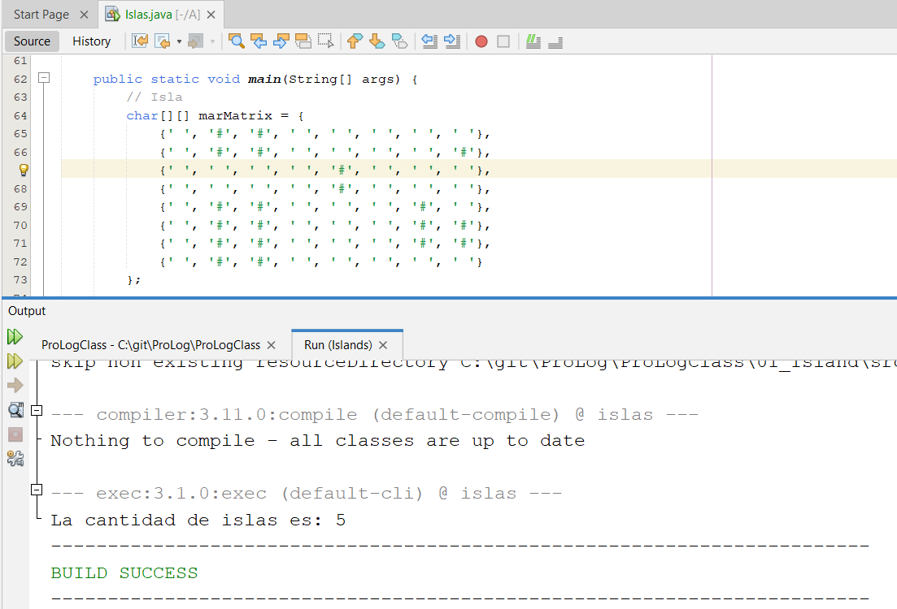
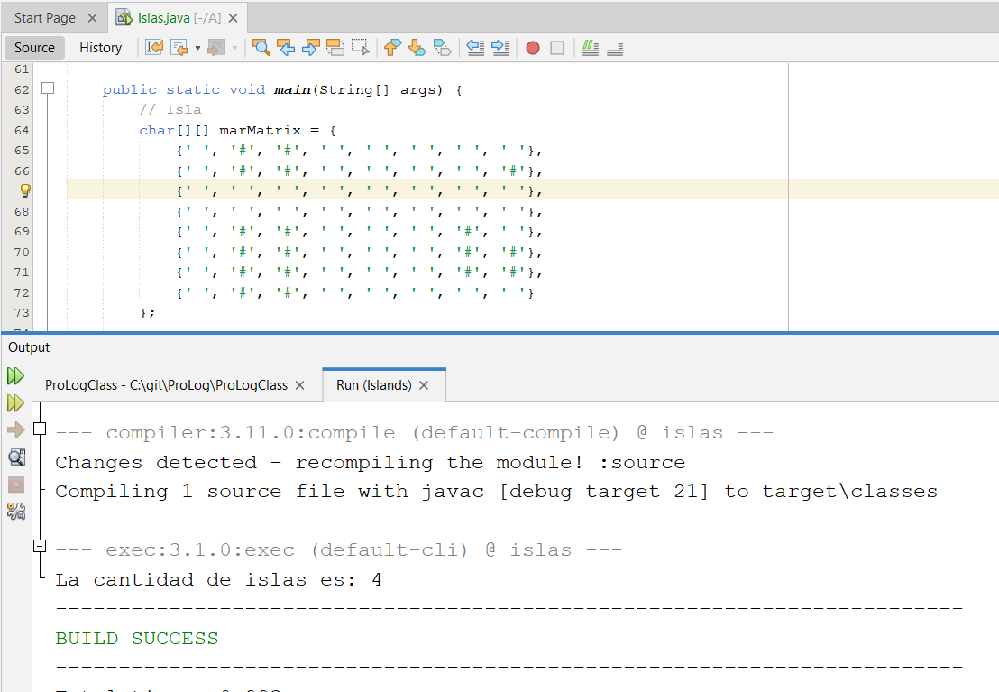

<p style="text-align: right;"><em>DATE: JANUARY - JUNE 2024</em></p>

## **ISLANDS EXERCISE**
### Made In: JAVA


#### Activity number: 02

#### **DESCRIPTION:**
#### The Java program counts the number of islands in a maze-like matrix using backtracking. It iterates through each cell, marking land areas and recursively exploring adjacent land cells to determine distinct islands, preventing reevaluation of previously visited cells."
________________________________________________________
________________________________________________________
#### Student: José López Lara
#### Control Number: 19120194
* [x] Student Email: l19120194@morelia.tecnm.mx
* [x] Personal Email: jose.lopez.lara.cto@gmail.com
* [x] GitHub Profile: [JoseLopezLara](https://github.com/JoseLopezLara)
* [x] Linkedin Profile: [in/jose-lopez-lara/](https://www.linkedin.com/in/jose-lopez-lara/) 
_______________________________________________________
_______________________________________________________

### **CODE:**

```java
public class Islas {

    private char[][] mar;

    public Islas(char[][] mar) {
        this.mar = mar;
    }

    public int buscarIslas() {
        int numeroDeIslas = 0;
        for (int x = 0; x < mar.length; x++) {
            for (int y = 0; y < mar[0].length; y++) {
                //Verificamos si no se rrecorrio ya, ya que el algoritmo recursivo
                //Puede modificar la matriz y cambiar una '#' por una 'r' que  aún
                //no se analiza.
                if (mar[x][y] != 'r') {
                    //Encontramos un elemento que representa tierra dentro de la isla
                    if (mar[x][y] == '#') {
                        numeroDeIslas++;
                        //Aplicamos busqueda de toda la  tierra que conforma 
                        //la isla y la marcamos.
                        buscarTierraRestante(x,y);
                    } else {
                        //Marcamos como recorrido
                        mar[x][y] = 'r';
                    }
                }

            }

        }
        return numeroDeIslas;       
    }

    private boolean buscarTierraRestante(int x, int y) {
        
        if(x >= 0 && x < mar.length && y >= 0 && y < mar[0].length){
            if( mar[x][y] == ' ' || mar[x][y] == 'r') return false;
            
            mar[x][y] = 'r';
            // Intentar moverse en todas las direcciones
            if (buscarTierraRestante(x + 1, y) || 
                buscarTierraRestante(x - 1, y) || 
                buscarTierraRestante(x, y + 1) || 
                buscarTierraRestante(x, y - 1)) {
                return true;
            }
        }
        
        return false;
    }
    
    public static void main(String[] args) {
        // Isla
        char[][] marMatrix = {
            {' ', '#', '#', ' ', ' ', ' ', ' ', ' '},
            {' ', '#', '#', ' ', ' ', ' ', ' ', '#'},
            {' ', ' ', ' ', ' ', '#', ' ', ' ', ' '},
            {' ', ' ', ' ', ' ', '#', ' ', ' ', ' '},
            {' ', '#', '#', ' ', ' ', ' ', '#', ' '},
            {' ', '#', '#', ' ', ' ', ' ', '#', '#'},
            {' ', '#', '#', ' ', ' ', ' ', '#', '#'},
            {' ', '#', '#', ' ', ' ', ' ', ' ', ' '}
        };

        Islas islas = new Islas(marMatrix);

        //Contar islas
        System.out.println("La cantidad de islas es: " + islas.buscarIslas());

    }  

    

}

```


### **TESTS:**
- ### **Test 1:**


- ### **Test 2:**
