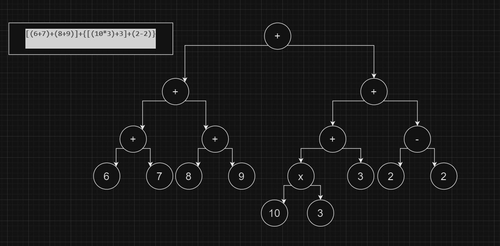

<p style="text-align: right;"><em>DATE: JANUARY - JUNE 2024</em></p>

## **EVALUATE EXPRESION IN PREORDEN AND POSTORDEN AND INORDEN FROM A BINARY TREE**
### Made In: Only MarkDown


#### Activity number: 04

#### **DESCRIPTION:**
#### In this exercise I change expresion from inorden to preorden and postorden using tranversal binary trees, and then evaluate with stacks. Like explication class"
________________________________________________________
________________________________________________________
#### Student: José López Lara
#### Control Number: 19120194
* [x] Student Email: l19120194@morelia.tecnm.mx
* [x] Personal Email: jose.lopez.lara.cto@gmail.com
* [x] GitHub Profile: [JoseLopezLara](https://github.com/JoseLopezLara)
* [x] Linkedin Profile: [in/jose-lopez-lara/](https://www.linkedin.com/in/jose-lopez-lara/) 
_______________________________________________________
_______________________________________________________

### **Exercise:**
```
EXPRESIÓN EN INORDEN: 6+7+8+9+10*3+3+2-2
Evaluamos:
6+7+8+9+10*3+3+2-2
6+7+8+9+30+3+2-2
= 63

GENERAMOS ARBOL
6+7+8+9+(10*3)+3+2-2
(6+7)+(8+9)+[(10*3)+3]+(2-2)
[(6+7)+(8+9)]+{[(10*3)+3]+(2-2)}
```

```
    - PASAR A INORDEN:
Usamos:
1. RECORRIDO ISQ
2. IMPRIMIR DATO
3. RECORRIDO DER
6+7+8+9+10*3+3+2-2 = 6+7+8+9+10*3+3+2-2 [CORRECTO] 

- PASAR A PREORDEN:
Usamos:
1. IMPRIMIR DATO
2. RECORRIDO IZQ
3. RECORRIDO DER
+ + + 6 7 + 8 9 + + * 10 3 3 - 2 2

Evaluamos
+|+|+|6|7
+|+|13|+|8|9
+|+|13|17
+|30|+|+|*|10|3
+|30|+|+|30
+|30|+|+|30|3 
+|30|+|33|-|2|2
+|30|+|33|0
+|30|33
63 [CORRECTO] 

- PASAR A POSTORDEN:
Usamos:
1. RECORRIDO IZQ
2. RECORRIDO DER
3. IMPRIMIR DATO
6 7 + 8 9 + + 10 3 * 3 + 2 2 - + +

Evaluamos:
6|7|+
13|8|9|+
13|17|+
30|10|3|*
30|30
30|30|3|+
30|33|2|2|-
30|33|0|+
30|33|+
63 [CORRECTO]

```