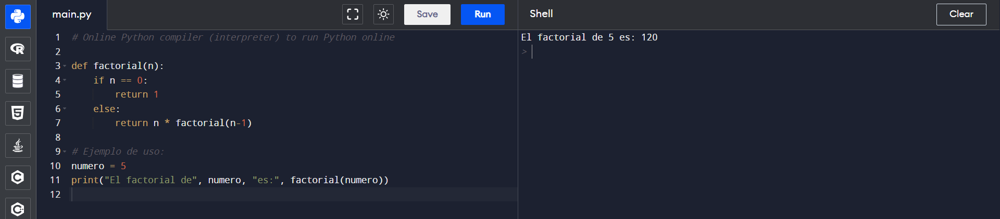
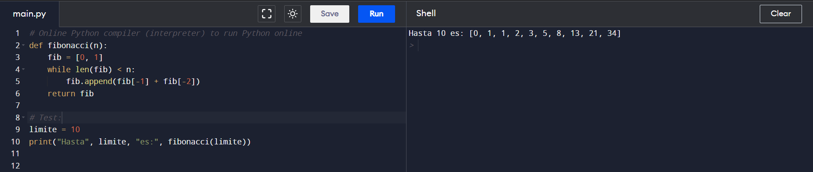

<p style="text-align: right;"><em>DATE: JANUARY - JUNE 2024</em></p>

## **Practica 2 Tipos de datos y Disciplina de tipos**

### Made In: Python, Java, C, Go, Pearl, Rust

#### Activity number: 06

#### **DESCRIPTION:**

#### Develop factorial of number excersice, fibonacci of number excersice and if a word is palindrome excersice. And check the difference paradigm, data disciplane and, data type and syntaxis of function

________________________________________________________
________________________________________________________

#### Student: José López Lara

#### Control Number: 19120194

* [x] Student Email: <l19120194@morelia.tecnm.mx>
* [x] Personal Email: <jose.lopez.lara.cto@gmail.com>
* [x] GitHub Profile: [JoseLopezLara](https://github.com/JoseLopezLara)
* [x] Linkedin Profile: [in/jose-lopez-lara/](https://www.linkedin.com/in/jose-lopez-lara/)

________________________________________________________
________________________________________________________

## **PYTHON LENGUAGE**

### **INVESTIGACIÓN:**

**Tipos de datos que maneja el lenguaje:**

Los tipos de datos básicos en Python son:

* Booleanos: Representan los valores de verdad True y False.
* Numéricos: Incluyen los enteros (int), los números de punto flotante (float), y los números complejos (complex).
* Cadenas de caracteres (str): Son secuencias de caracteres.

Además de los tipos de datos básicos, Python también define otros tipos de datos, que incluyen:

* Secuencias: Incluyen los tipos list, tuple y range.
* Mapas: Representados por el tipo dict.
* Conjuntos: Representados por el tipo set.
* Iteradores
* Clases
* Instancias
* Excepciones

**Disciplina de tipos:**

* Fuertemente Tipado
* Tipado dínamico

**Paradigma:**

Python es un lenguaje multiparadigma donde Los paradigmas principales son:

* Programación orientada a objetos (POO)
* Programación imperativa
* Programación funcional

**Estructura de una función:**

```python
def nombre_de_funcion(parametros):
    # bloque de codigo para ejecutar
    return valor # opcional
```

### **Factorial of Number**

```python
def factorial(n):
    if n == 0:
        return 1
    else:
        return n * factorial(n-1)

# Test:
numero = 5
print("El factorial de", numero, "es:", factorial(numero))
```

* #### **Test :**



### **Fibonacci of Number**

```python
def fibonacci(n):
    fib = [0, 1]
    while len(fib) < n:
        fib.append(fib[-1] + fib[-2])
    return fib

# Test:
limite = 10
print("Hasta", limite, "es:", fibonacci(limite))
```

* #### **Test :**



### **If a Word is Palindrome**

```python
# Online Python compiler (interpreter) to run Python online
def es_palindromo(palabra):
    longitud = len(palabra)
    for i in range(longitud // 2):
        if palabra[i] != palabra[longitud - i - 1]:
            return False
    return True

# Test:
palabra = "reconocer"
if es_palindromo(palabra):
    print(palabra, "Si es palíndromo.")
else:
    print(palabra, "No es palíndromo.")
```

* #### **Test :**


<!-- ----------------------------------- -->
<!-- ----------------------------------- -->
<!-- ----------------------------------- -->
