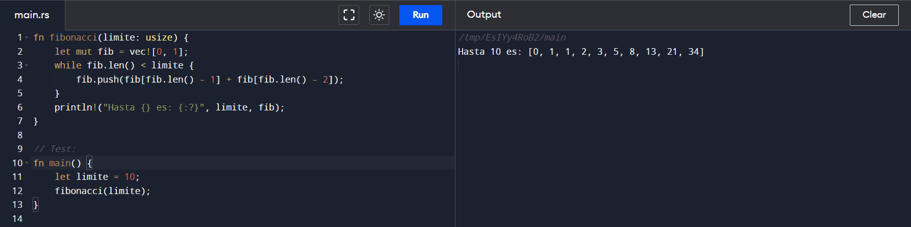

<p style="text-align: right;"><em>DATE: JANUARY - JUNE 2024</em></p>

## **Practica 2 Tipos de datos y Disciplina de tipos**

### Made In: Python, Java, C, Go, Pearl, Rust

#### Activity number: 06

#### **DESCRIPTION:**

#### Develop factorial of number excersice, fibonacci of number excersice and if a word is palindrome excersice. And check the difference paradigm, data disciplane and, data type and syntaxis of function

________________________________________________________
________________________________________________________

#### Student: José López Lara

#### Control Number: 19120194

* [x] Student Email: <l19120194@morelia.tecnm.mx>
* [x] Personal Email: <jose.lopez.lara.cto@gmail.com>
* [x] GitHub Profile: [JoseLopezLara](https://github.com/JoseLopezLara)
* [x] Linkedin Profile: [in/jose-lopez-lara/](https://www.linkedin.com/in/jose-lopez-lara/)

________________________________________________________
________________________________________________________

## **PYTHON LENGUAGE**

### **INVESTIGACIÓN:**

**Tipos de datos que maneja el lenguaje:**

Los tipos de datos básicos en Python son:

* Booleanos: Representan los valores de verdad True y False.
* Numéricos: Incluyen los enteros (int), los números de punto flotante (float), y los números complejos (complex).
* Cadenas de caracteres (str): Son secuencias de caracteres.

Además de los tipos de datos básicos, Python también define otros tipos de datos, que incluyen:

* Secuencias: Incluyen los tipos list, tuple y range.
* Mapas: Representados por el tipo dict.
* Conjuntos: Representados por el tipo set.
* Iteradores
* Clases
* Instancias
* Excepciones

**Disciplina de tipos:**

* Fuertemente Tipado
* Tipado dínamico

**Paradigma:**

Python es un lenguaje multiparadigma donde Los paradigmas principales son:

* Programación orientada a objetos (POO)
* Programación imperativa
* Programación funcional

**Estructura de una función:**

```python
def nombre_de_funcion(parametros):
    # bloque de codigo para ejecutar
    return valor # opcional
```

### **Factorial of Number**

```python
def factorial(n):
    if n == 0:
        return 1
    else:
        return n * factorial(n-1)

# Test:
numero = 5
print("El factorial de", numero, "es:", factorial(numero))
```

* #### **Test :**


### **Fibonacci of Number**

```python
def fibonacci(n):
    fib = [0, 1]
    while len(fib) < n:
        fib.append(fib[-1] + fib[-2])
    return fib

# Test:
limite = 10
print("Hasta", limite, "es:", fibonacci(limite))
```

* #### **Test :**


### **If a Word is Palindrome**

```python
# Online Python compiler (interpreter) to run Python online
def es_palindromo(palabra):
    longitud = len(palabra)
    for i in range(longitud // 2):
        if palabra[i] != palabra[longitud - i - 1]:
            return False
    return True

# Test:
palabra = "reconocer"
if es_palindromo(palabra):
    print(palabra, "Si es palíndromo.")
else:
    print(palabra, "No es palíndromo.")
```

* #### **Test :**


<!-- ----------------------------------- -->
<!-- ----------------------------------- -->
<!-- ----------------------------------- -->

## **C LENGUAGE**

### **INVESTIGACIÓN:**

**Tipos de datos que maneja el lenguaje:**

* char con signo de 8 bits
* char sin signo de 8 bits
* entero con signo de 16 bits
* entero sin signo de 16 bits
* entero con signo de 32 bits
* entero sin signo de 32 bits
* entero con signo de 64 bits
* entero sin signo de 64 bits
* coma flotante de 32 bits
* coma flotante de 64 bits
* coma flotante de 128 bits
* Punteros
* complejo de 64 bits
* complejo de 128 bits
* complejo de 256 bits
* bool
* coma flotante decimal de 32 bits
* coma flotante decimal de 64 bits
* coma flotante decimal de 128 bits
* Tipos definidos por usuario
    * Estos tipos de datos incluyen, entre otros, int, short y char.

**Disciplina de tipos:**

* Es: Debilmente tipado
* Es de: Tipado estatico.

**Paradigma:**

C es un lenguaje multiparadigma donde Los paradigmas son:

* Paradigma Imperativo
* Paradigama Estructurado

**Estructura de una función:**

```c
tipo_de_retorno nombre_de_funcion(parametros) {
    // bloque de código para ejecutar
    return valor; // opcional
}
```

### **Factorial of Number**

```c
int factorial(int n) {
    if (n == 0) {
        return 1;
    } else {
        return n * factorial(n-1);
    }
}

int main() {
    
    int numero = 5;
    printf("El factorial de %d es: %d\n", numero, factorial(numero));

}
```

* #### **Test :**


### **Fibonacci of Number**

```c
#include <stdio.h>

void fibonacci(int limite) {
    int fib[limite];
    fib[0] = 0;
    fib[1] = 1;
    for (int i = 2; i < limite; i++) {
        fib[i] = fib[i-1] + fib[i-2];
    }
    printf("Hasta %d es: ", limite);
    for (int i = 0; i < limite; i++) {
        printf("%d ", fib[i]);
    }
    printf("\n");
}

int main() {
    // Write C code here
    int limite = 10;
    fibonacci(limite);
}
```

* #### **Test :**


### **If a Word is Palindrome**

```c
#include <stdio.h>
#include <stdbool.h>
#include <string.h>

bool es_palindromo(char *palabra) {
    int longitud = strlen(palabra);
    for (int i = 0; i < longitud / 2; i++) {
        if (palabra[i] != palabra[longitud - i - 1]) {
            return false;
        }
    }
    return true;
}

int main() {
    char palabra[] = "reconocer";
    if (es_palindromo(palabra)) {
        printf("%s Si es palíndromo.\n", palabra);
    } else {
        printf("%s No es palíndromo.\n", palabra);
    }
}
```

* #### **Test :**


<!-- ----------------------------------- -->
<!-- ----------------------------------- -->
<!-- ----------------------------------- -->

## **JAVA LENGUAGE**

### **INVESTIGACIÓN:**

**Tipos de datos que maneja el lenguaje:**

Datos primitivos:

Los datos primitivos son tipos de datos básicos que representan valores simples y se almacenan directamente en la memoria, la lista de datos primitivos pueden ser:

* byte: Representa un tipo de dato de 8 bits con signo. Puede almacenar valores numéricos en el rango de -128 a 127, incluyendo ambos extremos. Es útil para ahorrar memoria cuando se necesita almacenar valores pequeños.

* short: Este tipo de dato utiliza 16 bits con signo y puede almacenar valores numéricos en el rango de -32,768 a 32,767. Se utiliza cuando se necesita un rango más amplio que el proporcionado por los bytes, pero aún se desea ahorrar memoria en comparación con los tipos de dato más grandes.

* int: Es un tipo de dato de 32 bits con signo utilizado para almacenar valores numéricos. Su rango va desde -2,147,483,648 (-2^31) hasta 2,147,483,647 (2^31 - 1). Es el tipo de dato más comúnmente utilizado para representar números enteros.

* long: Este tipo de dato utiliza 64 bits con signo y puede almacenar valores numéricos en el rango de -9,223,372,036,854,775,808 (-2^63) a 9,223,372,036,854,775,807 (2^63 - 1). Se utiliza cuando se necesitan números enteros muy grandes.

* float: Es un tipo de dato diseñado para almacenar números en coma flotante con precisión simple de 32 bits. Se utiliza cuando se requieren números decimales con un grado de precisión adecuado para muchas aplicaciones.

* double: Este tipo de dato almacena números en coma flotante con doble precisión de 64 bits, lo que proporciona una mayor precisión que float. Se usa en aplicaciones que requieren una alta precisión en cálculos numéricos.

* boolean: Sirve para definir tipos de datos booleanos que pueden tener solo dos valores: true o false. Aunque ocupa solo 1 bit de información, generalmente se almacena en un byte completo por razones de eficiencia.

* char: Es un tipo de datos que representa un carácter Unicode sencillo de 16 bits. Se utiliza para almacenar caracteres individuales, como letras o símbolos en diferentes lenguajes y conjuntos de caracteres.

Datos de referencia:

Los datos de referencia son tipos de datos más complejos que hacen referencia a objetos almacenados en memoria. Estos objetos pueden ser instancias de clases personalizadas o clases predefinidas en Java, como String.

Los datos de referencia no almacenan directamente el valor, sino una referencia a la ubicación en memoria donde se encuentra el objeto.

**Disciplina de tipos:**

* Es: Fuertemente tipado
* Es de: Tipado estatico.

**Paradigma:**

JAVA es un lenguaje multiparadigma donde Los paradigmas son:

* Orientado a objetos

* Imperativo

**Estructura de una función:**

```java
tipo_de_retorno nombre_de_funcion(tipo_de_parametro parametros) {
    // bloque de código para ejecutar
    return valor; // opcional
}
```

### **Factorial of Number**

```java
public class Factorial {
    public static int factorial(int n) {
        if (n == 0) {
            return 1;
        } else {
            return n * factorial(n-1);
        }
    }

    // Test:
    public static void main(String[] args) {
        int numero = 5;
        System.out.println("El factorial de " + numero + " es: " + factorial(numero));
    }
}
```

* #### **Test :**


### **Fibonacci of Number**

```java
public class Fibonacci {
    public static void fibonacci(int limite) {
        int[] fib = new int[limite];
        fib[0] = 0;
        fib[1] = 1;
        for (int i = 2; i < limite; i++) {
            fib[i] = fib[i-1] + fib[i-2];
        }
        System.out.print("Hasta " + limite + " es: ");
        for (int i = 0; i < limite; i++) {
            System.out.print(fib[i] + " ");
        }
        System.out.println();
    }

    // Test:
    public static void main(String[] args) {
        int limite = 10;
        fibonacci(limite);
    }
}
```

* #### **Test :**


### **If a Word is Palindrome**

```java
public class Palindromo {
    public static boolean esPalindromo(String palabra) {
        int longitud = palabra.length();
        for (int i = 0; i < longitud / 2; i++) {
            if (palabra.charAt(i) != palabra.charAt(longitud - i - 1)) {
                return false;
            }
        }
        return true;
    }

    // Test:
    public static void main(String[] args) {
        String palabra = "reconocer";
        if (esPalindromo(palabra)) {
            System.out.println(palabra + " Si es palindromo.");
        } else {
            System.out.println(palabra + " No es palindromo.");
        }
    }
}

```

* #### **Test :**

 

<!-- ----------------------------------- -->
<!-- ----------------------------------- -->
<!-- ----------------------------------- -->

## **PERL LENGUAGE**

### **INVESTIGACIÓN:**

**Tipos de datos que maneja el lenguaje:**

Perl tiene tres tipos de datos: escalares, listas y hashes:

* Un escalar es un solo valor; puede ser un número, un string (cadena de caracteres) o una referencia
* Una lista es una colección ordenada de escalares (una variable que almacena una lista se llama array)
* Un hash, o memoria asociativa, es un mapeo de strings a escalares; los strings se llaman claves y los escalares valores.

**Disciplina de tipos:**

* Es: Fuertemente tipado.
* Es de: Tipado dinamico.

**Paradigma:**

Perl es un lenguaje multiparadigma donde Los paradigmas son:

* Imperativa
* Funcional
* Prientada a objetos

**Estructura de una función:**

```perl
sub nombre_de_funcion {
    # bloque de código para ejecutar
    return valor; # opcional
}
```

### **Factorial of Number**

```perl
sub factorial {
    my $n = shift;
    if ($n == 0) {
        return 1;
    } else {
        return $n * factorial($n-1);
    }
}

# Test:
my $numero = 5;
print "El factorial de $numero es: ", factorial($numero), "\n";
```

* #### **Test :**


### **Fibonacci of Number**

```perl
sub fibonacci {
    my $limite = shift;
    my @fib = (0, 1);
    while (@fib < $limite) {
        push @fib, $fib[-1] + $fib[-2];
    }
    print "Hasta $limite es: @fib\n";
}

# Test:
my $limite = 10;
fibonacci($limite);
```

* #### **Test :**


### **If a Word is Palindrome**

```perl
sub es_palindromo {
    my $palabra = shift;
    my $longitud = length($palabra);
    for (my $i = 0; $i < $longitud / 2; $i++) {
        if (substr($palabra, $i, 1) ne substr($palabra, $longitud - $i - 1, 1)) {
            return 0;
        }
    }
    return 1;
}

# Test:
my $palabra = "reconocer";
if (es_palindromo($palabra)) {
    print "$palabra Si es palíndromo.\n";
} else {
    print "$palabra No es palíndromo.\n";
}
```

* #### **Test :**


<!-- ----------------------------------- -->
<!-- ----------------------------------- -->
<!-- ----------------------------------- -->

## **GO LENGUAGE**

### **INVESTIGACIÓN:**

**Tipos de datos que maneja el lenguaje:**

En Go, hay varios tipos de datos disponibles, que se pueden clasificar en cuatro categorías principales:

Tipos de datos básicos:

* bool: representa un valor booleano (true o false).
* string: representa una cadena de texto.
* int: representa un número entero.
* float32 y float64: representan números en coma flotante.

Tipos de datos compuestos:

* array: representa una colección de elementos del mismo tipo.
* slice: es similar a un array, pero su tamaño puede ser modificado dinámicamente.
* map: representa una colección de pares clave-valor.
* struct: representa un conjunto de campos con diferentes tipos de datos.

Tipos de datos de referencia:

* pointer: representa la dirección de memoria de una variable.
* function: representa una función.
* interface: define un conjunto de métodos que una estructura debe implementar.

Tipos de datos especiales:

* chan: se utiliza para la comunicación entre goroutines.
* complex64 y complex128: representan números complejos.

**Disciplina de tipos:**

* Es: Fuertemente tipado.
* Es de: Tipado estatico.

**Paradigma:**

Go es un lenguaje multiparadigma donde Los paradigmas son:

* Concurrente
* Imperactivo
* Estructurado

**Estructura de una función:**

```go
func nombreDeFuncion(parametros) tipoDeRetorno {
    // bloque de código para ejecutar
    return valor // opcional
}
```

### **Factorial of Number**

```go
package main

import "fmt"

func factorial(n int) int {
    if n == 0 {
        return 1
    } else {
        return n * factorial(n-1)
    }
}

// Test:
func main() {
    numero := 5
    fmt.Printf("El factorial de %d es: %d\n", numero, factorial(numero))
}
```

* #### **Test :**


### **Fibonacci of Number**

```go
package main

import "fmt"

func fibonacci(limite int) {
    fib := []int{0, 1}
    for i := 2; i < limite; i++ {
        fib = append(fib, fib[i-1]+fib[i-2])
    }
    fmt.Printf("Hasta %d es: %v\n", limite, fib)
}

// Test:
func main() {
    limite := 10
    fibonacci(limite)
}
```

* #### **Test :**


### **If a Word is Palindrome**

```go
package main

import "fmt"

func esPalindromo(palabra string) bool {
    longitud := len(palabra)
    for i := 0; i < longitud/2; i++ {
        if palabra[i] != palabra[longitud-i-1] {
            return false
        }
    }
    return true
}

// Test:
func main() {
    palabra := "reconocer"
    if esPalindromo(palabra) {
        fmt.Printf("%s Si es palíndromo.\n", palabra)
    } else {
        fmt.Printf("%s No es palíndromo.\n", palabra)
    }
}
```

* #### **Test :**


<!-- ----------------------------------- -->
<!-- ----------------------------------- -->
<!-- ----------------------------------- -->

## **RUST LENGUAGE**

### **INVESTIGACIÓN:**

**Tipos de datos que maneja el lenguaje:**

Tipos escalares.

Un tipo escalar representa un valor único. Rust tiene cuatro tipos escalares principales:

* Enteros
* Números de punto flotante
* Booleanos
* Caracteres.

Tipos Compuestos.

Los tipos compuestos pueden agrupar varios valores en un solo tipo. Rust tiene dos tipos de compuestos primitivos:

* Tuplas.
* Matrices.

**Disciplina de tipos:**

* Es: Fuertemente tipado.
* Es de: Tipado estatico.

**Paradigma:**

Rust es un lenguaje multiparadigma donde Los paradigmas son:

* Programación funcional pura.
* Por procedimientos
* Imperativa
* Orientada a objetos.

**Estructura de una función:**

```rust
fn nombre_de_funcion(parametros) -> tipo_de_retorno {
    // bloque de código para ejecutar
    valor // opcional
}
```

### **Factorial of Number**

```rust
fn factorial(n: u64) -> u64 {
    if n == 0 {
        1
    } else {
        n * factorial(n - 1)
    }
}

// Test:
fn main() {
    let numero = 5;
    println!("El factorial de {} es: {}", numero, factorial(numero));
}
```

* #### **Test :**


### **Fibonacci of Number**

```rust
fn fibonacci(limite: usize) {
    let mut fib = vec![0, 1];
    while fib.len() < limite {
        fib.push(fib[fib.len() - 1] + fib[fib.len() - 2]);
    }
    println!("Hasta {} es: {:?}", limite, fib);
}

// Test:
fn main() {
    let limite = 10;
    fibonacci(limite);
}
```

* #### **Test :**



### **If a Word is Palindrome**

```rust
fn es_palindromo(palabra: &str) -> bool {
    let longitud = palabra.len();
    for i in 0..longitud / 2 {
        if palabra.as_bytes()[i] != palabra.as_bytes()[longitud - i - 1] {
            return false;
        }
    }
    true
}

// Test:
fn main() {
    let palabra = "reconocer";
    if es_palindromo(palabra) {
        println!("{} Si es palíndromo.", palabra);
    } else {
        println!("{} No es palíndromo.", palabra);
    }
}
```

* #### **Test :**


