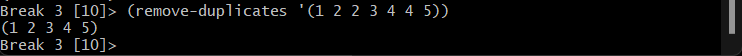

<em>DATE: JANUARY - JUNE 2024</em>

## **Activity, document 20 predefinited function of CLISP Lenguaje**

### Made In: OnlyMarkDown

#### Activity number: 07

#### **DESCRIPTION:**

#### Find 20 funcitions predefinited if CLISP in Internet and test this functions. Then, document this functions

________________________________________________________
________________________________________________________

#### Student: José López Lara

#### Control Number: 19120194

* [x] Student Email: <l19120194@morelia.tecnm.mx>
* [x] Personal Email: <jose.lopez.lara.cto@gmail.com>
* [x] GitHub Profile: [JoseLopezLara](https://github.com/JoseLopezLara)
* [x] Linkedin Profile: [in/jose-lopez-lara/](https://www.linkedin.com/in/jose-lopez-lara/)

________________________________________________________
________________________________________________________

## **20 Functions in LISP**

1. **MAX Function**
This function return the higher number of a lisp of numbers.
    * **Test :**

2. **MIN Function**
Returns the lowest number in a list of numbers.
    * **Test :**

3. **CAR Function**
Returns the first element of a list.
    * **Test :**

4. **CDR Function**
Returns a list without its first element.
    * **Test :**

5. **CONS Function**
Constructs a new list by adding an element to the front of an existing list.
    * **Test :**

6. **LENGTH Function**
Returns the length of a list.
    * **Test :**

7. **APPEND Function**
Concatenates two or more lists.
    * **Test :**

8. **REVERSE Function**
Reverses the order of elements in a list.
    * **Test :**

9. **MEMBER Function**
Checks if an element is a member of a list and return the element an the next elements of the list.
    * **Test :**

10. **REMOVE Function**
Removes occurrences of an element from a list.
    * **Test :**

11. **SUBST Function**
Substitutes a new element for specified elements in a list.
    * **Test :**

12. **LSIT Function**
Applies a function to corresponding elements of one or more lists.
    * **Test :**

13. **NULL Function**
Checks if a list is empty.
    * **Test :**

14. **NUMBERP Function**
Checks if an object is a number.
    * **Test :**

15. **SORT Function**
Sorts a list based on a comparison function.
    * **Test :**

16. **REMOVE-DUPLICATES Function**
Removes duplicate elements from a list.
    * **Test :**

17. **NTH Function**
Returns the element from a positions of a list.
    * **Test :**

18. **LAST Function**
Returns the last element of a list.
    * **Test :**

19. **BUTLAST Function**
Returns a list without the last element.
    * **Test :**

20. **LIST STRINGP**
Checks if an object is a string.
    * **Test :**

