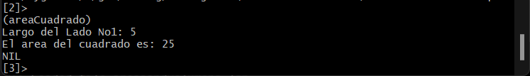

<p style="text-align: right;"><em>DATE: JANUARY - JUNE 2024</em></p>

## **Activity, 10 Areas and 10 Volumens in CLISP**

### Made In: CLISP

#### Activity number: 08

#### **DESCRIPTION:**

#### Program 10 areas and 10 volumens in CLISP lenguage, when you need request from keyboard the necesary number to calc area or volumen

________________________________________________________
________________________________________________________

#### Student: José López Lara

#### Control Number: 19120194

* [x] Student Email: <l19120194@morelia.tecnm.mx>
* [x] Personal Email: <jose.lopez.lara.cto@gmail.com>
* [x] GitHub Profile: [JoseLopezLara](https://github.com/JoseLopezLara)
* [x] Linkedin Profile: [in/jose-lopez-lara/](https://www.linkedin.com/in/jose-lopez-lara/)

________________________________________________________
________________________________________________________

## **10 Areas in LISP**

1. **Area No.1 Cuadrado**
This function return the higher number of a lisp of numbers.

```lisp
;Area y Volumen de un Cuadrado
;-----------------------------------------------
(defun areaCuadrado()
    (princ "Largo del Lado No1: ")
    (setq lado1 (read))
    (setq resultado (* lado1 lado1))
    (format t "El area del cuadrado es: ~a" resultado)
)

(defun volumenCuadrado()
    (princ "Largo del Lado No1: ")
    (setq lado1 (read))
    (setq resultado (* lado1 lado1 lado1))
    (format t "El volumen del cuadrado es: ~a" resultado)
)
```

* **Test Cuadrado :**


