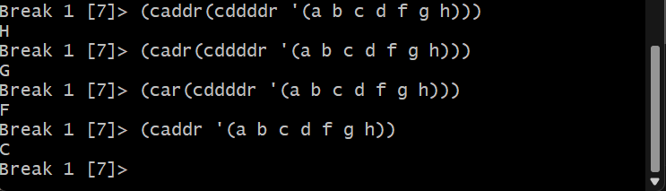
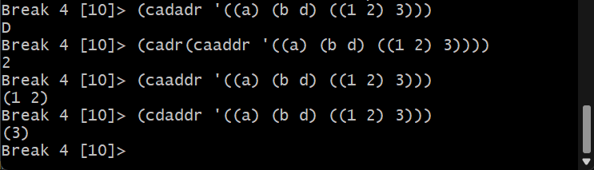
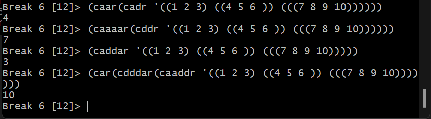

<p style="text-align: right;"><em>DATE: JANUARY - JUNE 2024</em></p>

## **Activity, CAR Y CDR FUNCTIONS in CLISP**

### Made In: CLISP

#### Activity number: 09

#### **DESCRIPTION:**

#### For the list given, you need employed CAR and CDR functions to take out the especifict elemento of the list

________________________________________________________
________________________________________________________

#### Student: José López Lara

#### Control Number: 19120194

* [x] Student Email: <l19120194@morelia.tecnm.mx>
* [x] Personal Email: <jose.lopez.lara.cto@gmail.com>
* [x] GitHub Profile: [JoseLopezLara](https://github.com/JoseLopezLara)
* [x] Linkedin Profile: [in/jose-lopez-lara/](https://www.linkedin.com/in/jose-lopez-lara/)

________________________________________________________
________________________________________________________

## **CAR Y CDR Activity**

1. **List No. 1**

```lisp
;List No. 1: (a b c d f g h)
;Take out: h
(caddr(cddddr '(a b c d f g h)))
;Take out: g
(cadr(cddddr '(a b c d f g h)))
;Take out: f
(car(cddddr '(a b c d f g h)))
;Take out: c
(caddr '(a b c d f g h))
```

**Test:**



2. **List No. 2**

```lisp
;List No. 2: ((a) (b d) ((1 2) 3))
;Take out: d
(cadadr '((a) (b d) ((1 2) 3)))
;Take out: 2
(cadr(caaddr '((a) (b d) ((1 2) 3))))
;Take out: (1 2)
(caaddr '((a) (b d) ((1 2) 3)))
;Take out: (3)
(cdaddr '((a) (b d) ((1 2) 3)))
```



**Test:**

3. **List No. 3**

```lisp
;List No. 2: ((1 2 3) ((4 5 6 )) (((7 8 9 10))))
;Take out: 4
(caar(cadr '((1 2 3) ((4 5 6 )) (((7 8 9 10))))))
;Take out: 7
(caaaar(cddr '((1 2 3) ((4 5 6 )) (((7 8 9 10))))))
;Take out: 3
(caddar '((1 2 3) ((4 5 6 )) (((7 8 9 10)))))
;Take out: 10
(car(cdddar(caaddr '((1 2 3) ((4 5 6 )) (((7 8 9 10)))))))
```

**Test:**

