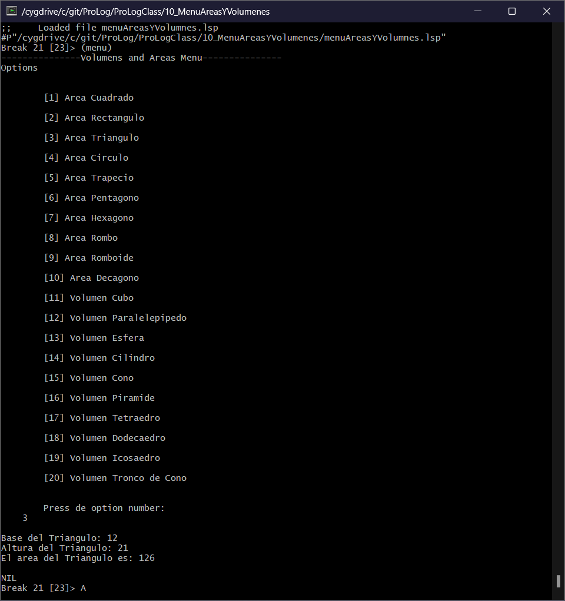
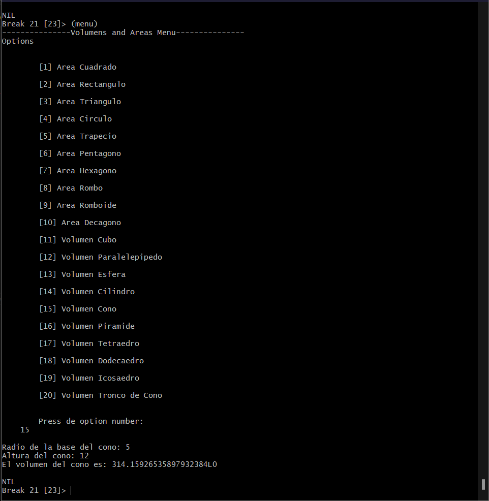

<p style="text-align: right;"><em>DATE: JANUARY - JUNE 2024</em></p>

## **Activity, Menu of Areas and Volumnes**

### Made In: CLISP

#### Activity number: 10

#### **DESCRIPTION:**

#### For this activity, We need use the maked functios used in the activity number 08 and add a Menu to acces to any function of area or volumen. To make the menu, we need use cond and case fuctions. 

________________________________________________________
________________________________________________________

#### Student: José López Lara

#### Control Number: 19120194

* [x] Student Email: <l19120194@morelia.tecnm.mx>
* [x] Personal Email: <jose.lopez.lara.cto@gmail.com>
* [x] GitHub Profile: [JoseLopezLara](https://github.com/JoseLopezLara)
* [x] Linkedin Profile: [in/jose-lopez-lara/](https://www.linkedin.com/in/jose-lopez-lara/)

________________________________________________________
________________________________________________________

## **Menu Maked with Cond and Case**

### **CODE:**

```lisp
;Menu Selection
;----------------------------------------------
(defun menu()
    (format t "---------------Volumens and Areas Menu--------------- ~%")

    (format t "Options ~%

        [1] Area Cuadrado ~% 
        [2] Area Rectangulo ~%
        [3] Area Triangulo ~%
        [4] Area Circulo ~%
        [5] Area Trapecio ~%
        [6] Area Pentagono ~%
        [7] Area Hexagono ~%
        [8] Area Rombo ~%
        [9] Area Romboide ~%
        [10] Area Decagono ~%
        [11] Volumen Cubo ~%
        [12] Volumen Paralelepipedo ~%
        [13] Volumen Esfera ~%
        [14] Volumen Cilindro ~%
        [15] Volumen Cono ~%
        [16] Volumen Piramide ~%
        [17] Volumen Tetraedro ~%
        [18] Volumen Dodecaedro ~%
        [19] Volumen Icosaedro ~%
        [20] Volumen Tronco de Cono ~% 
        
        Press de option number: 
    ")
    (setq option (read))
    
    (format t "~%")

    ;Select menu using COND
    (cond   
        ((= option 1) (areaCuadrado))
        ((= option 2) (areaRectangulo))
        ((= option 3) (areaTriangulo))
        ((= option 4) (areaCirculo))
        ((= option 5) (areaTrapecio))
        ((= option 6) (areaPentagono))
        ((= option 7) (areaHexagono))
        ((= option 8) (areaRombo))
        ((= option 9) (areaRomboide))
        ((= option 10) (areaDecagono))
    )

    (case option
        ((11) (volumenCubo))
        ((12) (volumenParalelepipedo))       
        ((13) (volumenEsfera))       
        ((14) (volumenCilindro))       
        ((15) (volumenCono))       
        ((16) (volumenPiramide))       
        ((17) (volumenTetraedro))       
        ((18) (volumenDodecaedro))       
        ((19) (volumenIcosaedro))       
        ((20) (volumenTroncoCono))       
    )

    (format t "~% ~%")
    
)


;Area y Volumen de un Cuadrado
;-----------------------------------------------
(defun areaCuadrado()
    (princ "Largo del Lado No1: ")
    (setq lado1 (read))
    (setq resultado (* lado1 lado1))
    (format t "El area del cuadrado es: ~a" resultado)
)

;Area de un Rectangulo
;-----------------------------------------------
(defun areaRectangulo()
    (princ "Base del Rectangulo: ")
    (setq base (read))
    (princ "Altura del Rectangulo: ")
    (setq altura (read))
    (setq resultado (* base altura))
    (format t "El area del Rectangulo es: ~a" resultado)
)

;Area de un Triangulo
;-----------------------------------------------
(defun areaTriangulo()
    (princ "Base del Triangulo: ")
    (setq base (read))
    (princ "Altura del Triangulo: ")
    (setq altura (read))
    (setq resultado (/ (* base altura) 2))
    (format t "El area del Triangulo es: ~a" resultado)
)

;Area de un Circulo
;-----------------------------------------------
(defun areaCirculo()
    (princ "Radio del Circulo: ")
    (setq radio (read))
    (setq resultado (* pi (* radio radio)))
    (format t "El area del Circulo es: ~a" resultado)
)

;Area de un Trapecio
;-----------------------------------------------
(defun areaTrapecio()
    (princ "Base menor del trapecio: ")
    (setq baseMenor (read))
    (princ "Base mayor del trapecio: ")
    (setq baseMayor (read))
    (princ "Altura del trapecio: ")
    (setq altura (read))
    (setq resultado (* (/ (+ baseMenor baseMayor) 2) altura))
    (format t "El area del trapecio es: ~a" resultado)
)

;Area de un Pentagono
;-----------------------------------------------
(defun areaPentagono()
    (princ "Apotema del pentagono: ")
    (setq apotema (read))
    (princ "Lado del pentagono: ")
    (setq lado (read))
    (setq resultado (* (/ (* 5 lado) 2) apotema))
    (format t "El area del pentagono es: ~a" resultado)
)

;Area de un Hexagono
;-----------------------------------------------
(defun areaHexagono()
    (princ "Apotema del Hexagono: ")
    (setq apotema (read))
    (princ "Lado del Hexagono: ")
    (setq lado (read))
    (setq resultado (* (/ (* 6 lado) 2) apotema))
    (format t "El area del Hexagono es: ~a" resultado)
)

;Area de un Rombo
;-----------------------------------------------
(defun areaRombo()
    (princ "Diagonal mayor del rombo: ")
    (setq diagonalMayor (read))
    (princ "Diagonal menor del rombo: ")
    (setq diagonalMenor (read))
    (setq resultado (/ (* diagonalMayor diagonalMenor) 2))
    (format t "El area del rombo es: ~a" resultado)
)

;Area de un Romboide
;-----------------------------------------------
(defun areaRomboide()
    (princ "Base del romboide: ")
    (setq base (read))
    (princ "Altura del romboide: ")
    (setq altura (read))
    (setq resultado (* base altura))
    (format t "El area del romboide es: ~a" resultado)
)

;Area de un Decagono
;-----------------------------------------------
(defun areaDecagono()
    (princ "Apotema del Decagono: ")
    (setq apotema (read))
    (princ "Lado del Decagono: ")
    (setq lado (read))
    (setq resultado (* (/ (* 10 lado) 2) apotema))
    (format t "El area del Decagono es: ~a" resultado)
)
;-----------------------------------------------
;-----------------------------------------------
;-----------------------------------------------
;-----------------------------------------------

;Volumen de un Cubo
;-----------------------------------------------
(defun volumenCubo()
    (princ "Largo del Lado No1: ")
    (setq lado1 (read))
    (setq resultado (* lado1 lado1 lado1))
    (format t "El volumen del cubo es: ~a" resultado)
)
;Volumen de un Paralelepípedo
;-----------------------------------------------
(defun volumenParalelepipedo()
    (princ "Longitud del lado A: ")
    (setq ladoA (read))
    (princ "Longitud del lado B: ")
    (setq ladoB (read))
    (princ "Longitud del lado C: ")
    (setq ladoC (read))
    (setq resultado (* ladoA ladoB ladoC))
    (format t "El volumen del paralelepípedo es: ~a" resultado)
)

;Volumen de una Esfera
;-----------------------------------------------
(defun volumenEsfera()
    (princ "Radio de la esfera: ")
    (setq radio (read))
    (setq resultado (/ (* 4 pi (* radio radio radio)) 3))
    (format t "El volumen de la esfera es: ~a" resultado)
)

;Volumen de un Cilindro
;-----------------------------------------------
(defun volumenCilindro()
    (princ "Radio de la base del cilindro: ")
    (setq radioBase (read))
    (princ "Altura del cilindro: ")
    (setq altura (read))
    (setq resultado (* pi (* radioBase radioBase) altura))
    (format t "El volumen del cilindro es: ~a" resultado)
)

;Volumen de un Cono
;-----------------------------------------------
(defun volumenCono()
    (princ "Radio de la base del cono: ")
    (setq radioBase (read))
    (princ "Altura del cono: ")
    (setq altura (read))
    (setq resultado (/ (* pi (* radioBase radioBase) altura) 3))
    (format t "El volumen del cono es: ~a" resultado)
)

;Volumen de una Piramide
;-----------------------------------------------
(defun volumenPiramide()
    (princ "Área de la base de la Piramide: ")
    (setq areaBase (read))
    (princ "Altura de la Piramide: ")
    (setq altura (read))
    (setq resultado (/ (* areaBase altura) 3))
    (format t "El volumen de la Piramide es: ~a" resultado)
)

;Volumen de un Tetraedro
;-----------------------------------------------
(defun volumenTetraedro()
    (princ "Longitud de un lado del tetraedro: ")
    (setq lado (read))
    (setq resultado (/ (* (sqrt 2) (* lado lado lado)) 12))
    (format t "El volumen del tetraedro es: ~a" resultado)
)

;Volumen de un Dodecaedro
;-----------------------------------------------
(defun volumenDodecaedro()
    (princ "Longitud de un lado del dodecaedro: ")
    (setq lado (read))
    (setq resultado (* (* lado lado lado) (/ (+ 15 (* 7 (sqrt 5))) 4)))
    (format t "El volumen del dodecaedro es: ~a" resultado)
)

;Volumen de un Icosaedro
;-----------------------------------------------
(defun volumenIcosaedro()
    (princ "Longitud de un lado del icosaedro: ")
    (setq lado (read))
    (setq resultado (* (/ ( * 5 (+ (sqrt 5) 3)) 12) (* lado lado lado)))
    (format t "El volumen del icosaedro es: ~a" resultado)
)

;Volumen de un Tronco de Cono
;-----------------------------------------------
(defun volumenTroncoCono()
    (princ "Radio de la base mayor del tronco de cono: ")
    (setq radioMayor (read))
    (princ "Radio de la base menor del tronco de cono: ")
    (setq radioMenor (read))
    (princ "Altura del tronco de cono: ")
    (setq altura (read))
    (setq resultado (* (+ (* radioMayor radioMenor) (* radioMayor radioMayor) (* radioMenor radioMenor)) (/ (* altura pi) 3)))
    (format t "El volumen del tronco de cono es: ~a" resultado)
)
```

**Test (Area):**



**Test (Volumne):**


