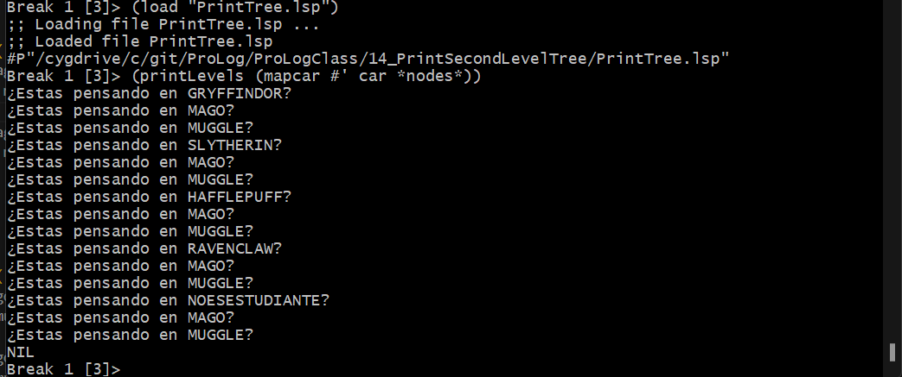
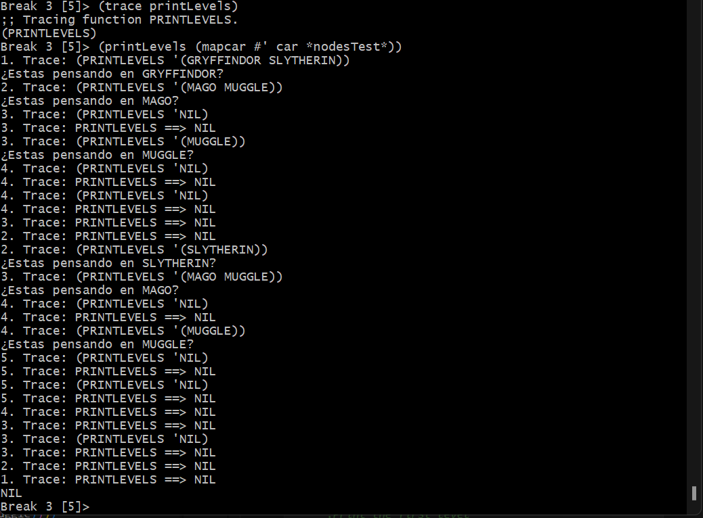

<p style="text-align: right;"><em>DATE: JANUARY - JUNE 2024</em></p>

## **Activity, Print the Second Level of Tree**

### Made In: CLISP

#### Activity number: 14

#### **DESCRIPTION:**

#### Using the functions defparameter mapcar, asocc, car, cdr, #', ' and `. We need make a tree with any tematic, and then, we need print the firs and second level

________________________________________________________
________________________________________________________

#### Student: José López Lara

#### Control Number: 19120194

* [x] Student Email: <l19120194@morelia.tecnm.mx>
* [x] Personal Email: <jose.lopez.lara.cto@gmail.com>
* [x] GitHub Profile: [JoseLopezLara](https://github.com/JoseLopezLara)
* [x] Linkedin Profile: [in/jose-lopez-lara/](https://www.linkedin.com/in/jose-lopez-lara/)

________________________________________________________
________________________________________________________

### **Tree**

* The tree is about the Harry Potter

```lisp

(defun printLevels(list)
    ;Print the first level
    (if list
      (format t "¿Estas pensando en ~a? ~%" (car list))
    )
    
    ;Print the second level
    (if list
      (printLevel (mapcar #' car (cadr (assoc (car list) *nodes*))))
    )
    
    (if list
      (printLevel (cdr list))
    )
)

(defparameter *nodesTest*
            '((Gryffindor (
							(MagoG (Es mago))
              (MuggleG (Es muggle))))
						 (Slytherin(
							(MagoS (Es mago))
              (MuggleS (Es muggle))))
						 
						 )
  )

(defparameter *nodes*
            '((Gryffindor (
							(Mago (Es mago))
              (Muggle (Es muggle))))
						 (Slytherin(
							(Mago (Es mago))
              (Muggle (Es muggle))))
						 (Hafflepuff(
							(Mago (Es mago))
              (Muggle (Es muggle))))
						 (Ravenclaw(
							(Mago (Es mago))
              (Muggle (Es muggle))))
             (NoEsEstudiante(
							(Mago (Es mago))
              (Muggle (Es muggle))))
						 )
  )
```

### **Test: Print the first and second level**



### **Test: Print the first and second level, but using trace and chek that printed the correct branch**


