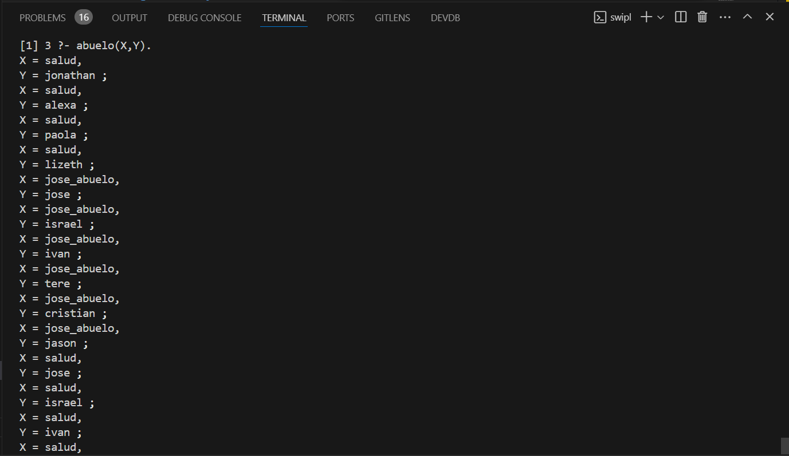

<p style="text-align: right;"><em>DATE: JANUARY - JUNE 2024</em></p>

## **Activity, Meke a Genealogical Family tree Relations With Rules**

### Made In: ProLog

#### Activity number: 16

#### **DESCRIPTION:**

#### Make a ralation in logic of first order about the genealogical family tree and then, add inference rules to generate family relations like brother, uncle, grantfather, etc

________________________________________________________
________________________________________________________

#### Student: José López Lara

#### Control Number: 19120194

* [x] Student Email: <l19120194@morelia.tecnm.mx>
* [x] Personal Email: <jose.lopez.lara.cto@gmail.com>
* [x] GitHub Profile: [JoseLopezLara](https://github.com/JoseLopezLara)
* [x] Linkedin Profile: [in/jose-lopez-lara/](https://www.linkedin.com/in/jose-lopez-lara/)

________________________________________________________
________________________________________________________

### **Genalogica Family Tree**

* **INFERENCE RULES:**

```prolog
abuelo(X,Y):- padrede(X,Z), padrede(Z,Y); padrede(X,Z), madrede(Z,Y).
abuela(X,Y):- madrede(X,Z), padrede(Z,Y); madrede(X,Z), madrede(Z,Y).
niete(Y,X):- padrede(X,Z), padrede(Z,Y); madrede(X,Z), madrede(Z,Y).
hermane(A,B):- padrede(X,A), padrede(X,B); madrede(X,A), madrede(X,B).
tie(B,C):- hermane(A,B), padrede(A,C); hermane(A,B), madrede(A,C).
```

* **CODE:**

```prolog
hijo(jose).
hijo(israel).
hijo(ivan).
hijo(jose_padre).
hijo(carlos).    
hijo(refugio).
hijo(jonathan).                
hijo(isidro).
hijo(roberto).
hijo(javier).
hijo(cesar).
hijo(edwin). 
hijo(willian).
hijo(ignacio).
hijo(cristian).        
hijo(alejandro).
hijo(jason). 
hijo(willian_l).
hija(veronica).
hija(alejandra).
hija(aira).
hija(anaury). 
hija(leticia). 
hija(alexa).     
hija(paola).         
hija(rosa).
hija(viviana).
hija(martha).
hija(tere).
hija(karla).     
hija(laura).
padre(salud).   
padre(jose_padre).
padre(jose_abuelo).
padre(ignacio).
padre(alejandro).
padre(refugio).
padre(roberto).
padre(javier).
madre(leticia).
madre(martha_abuela).
madre(paula).
madre(rosa).
madre(laura).
madre(martha).
madre(veronica).
padrede(ignacio, tere).
padrede(ignacio, cristian).
padrede(alejandro, jason).
padrede(salud, leticia).
padrede(salud, carlos).
padrede(salud, refugio).
padrede(salud, isidro).
padrede(salud, roberto).
padrede(salud, javier).
padrede(salud, laura).
padrede(salud, rosa).
padrede(jose_abuelo, jose_padre).
padrede(jose_abuelo, ignacio).
padrede(jose_abuelo, alejandro).
padrede(jose_abuelo, martha).
padrede(jose_abuelo, veronica).
padrede(jose_padre, jose).
padrede(jose_padre, israel).
padrede(jose_padre, ivan).
padrede(refugio, jonathan). 
padrede(roberto, alexa). 
padrede(javier, paola).
padrede(javier, lizeth).
madrede(paula, leticia).
madrede(paula, carlos).
madrede(paula, refugio).
madrede(paula, isidro).
madrede(paula, roberto).
madrede(paula, javier).
madrede(paula, rosa).
madrede(paula, laura).
madrede(martha_abuela, jose_padre).
madrede(martha_abuela, ignacio).
madrede(martha_abuela, alejandro).
madrede(martha_abuela, martha).
madrede(martha_abuela, veronica).
madrede(leticia, jose).
madrede(leticia, israel).
madrede(leticia, ivan).
madrede(rosa, viviana).
madrede(laura, edwin).
madrede(laura, willian).
madrede(laura, karla).
madrede(rosa, cesar).
madrede(rosa, edwin).
madrede(rosa, willian).
madrede(rosa, karla).
madrede(martha, willian_l).
madrede(veronica, alejandra).
madrede(veronica, aira).
madrede(veronica, anaury).
abuelo(X,Y):- padrede(X,Z), padrede(Z,Y); padrede(X,Z), madrede(Z,Y).
abuela(X,Y):- madrede(X,Z), padrede(Z,Y); madrede(X,Z), madrede(Z,Y).
niete(Y,X):- padrede(X,Z), padrede(Z,Y); madrede(X,Z), madrede(Z,Y).
hermane(A,B):- padrede(X,A), padrede(X,B); madrede(X,A), madrede(X,B).
tie(B,C):- hermane(A,B), padrede(A,C); hermane(A,B), madrede(A,C).
```

**Test: abuelo(X,Y)**


**Test: abuela(X,Y)**


**Test: niete(Y,X)**


**Test: hermane(A,B)**


**Test: tie(B,C)**
