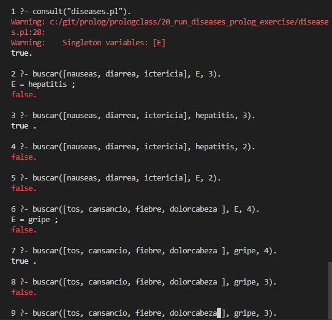

<p style="text-align: right;"><em>DATE: JANUARY - JUNE 2024</em></p>

## **Activity, Run Diseases Exercise**

### Made In: CLISP

#### Activity number: 20

#### **DESCRIPTION:**

#### You neer to run the exaple provider by teacher about an expert system with the Diseases them in SWIPL

________________________________________________________
________________________________________________________

#### Student: José López Lara

#### Control Number: 19120194

* [x] Student Email: <l19120194@morelia.tecnm.mx>
* [x] Personal Email: <jose.lopez.lara.cto@gmail.com>
* [x] GitHub Profile: [JoseLopezLara](https://github.com/JoseLopezLara)
* [x] Linkedin Profile: [in/jose-lopez-lara/](https://www.linkedin.com/in/jose-lopez-lara/)

________________________________________________________
________________________________________________________

### **Genalogica Family Tree**

* **INFERENCE RULES:**

```prolog
buscar(X , E , 1) :- sintomade(X, E).
buscar([X|Xs] , E , P) :- enfermedad(E) , buscar(X, E , S1) , buscar(Xs , E ,S2) , P is S1 + S2.
```

* **CODE:**

```prolog
enfermedad(gripe).
enfermedad(rubeola).
enfermedad(malaria).
enfermedad(hepatitis).
enfermedad(tuberculosis).
enfermedad(anemia).
sintomade(nauseas, hepatitis). 
sintomade(diarrea, hepatitis). 
sintomade(ictericia, hepatitis).
sintomade(tos, gripe).
sintomade(cansancio, gripe).
sintomade(fiebre, gripe).
sintomade(dolorcabeza, gripe).
sintomade(cansancio, anemia).
sintomade(apatia, anemia).
sintomade(nausea, anemia).
sintomade(tos, tuberculosis).
sintomade(cansancio, tuberculosis).
sintomade(fiebre, tuberculosis).
sintomade(escalofrios, tuberculosis).
sintomade(escalofrios, malaria).
sintomade(fiebre , malaria).
sintomade(diarrea , malaria).
sintomade(ictericia, malaria).
sintomade(fiebre, rubeola).
sintomade(jaqueca, rubeola).
sintomade(secrecion, rubeola).
buscar([], E , 0).
buscar(X , E , 1) :- sintomade(X, E).
buscar([X|Xs] , E , P) :- enfermedad(E) , buscar(X, E , S1) , buscar(Xs , E ,S2) , P is S1 + S2.
```

**Test: Prueba de funcionamiento**

