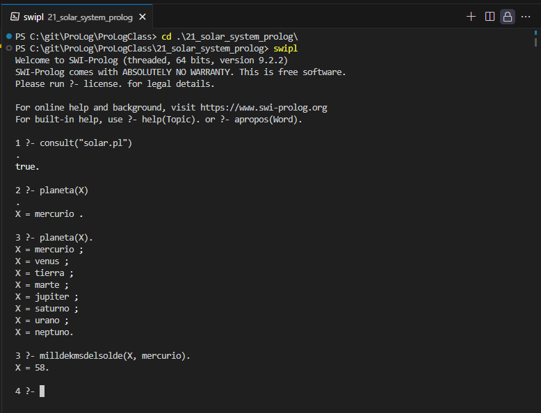

<p style="text-align: right;"><em>DATE: JANUARY - JUNE 2024</em></p>

## **Activity, Solar System in Prolog**

### Made In: ProLog

#### Activity number: 21

#### **DESCRIPTION:**

#### Make a knowledge base about solar system. You need take consider planets satellites asteroid and stars, when you find information

________________________________________________________
________________________________________________________

#### Student: José López Lara

#### Control Number: 19120194

* [x] Student Email: <l19120194@morelia.tecnm.mx>
* [x] Personal Email: <jose.lopez.lara.cto@gmail.com>
* [x] GitHub Profile: [JoseLopezLara](https://github.com/JoseLopezLara)
* [x] Linkedin Profile: [in/jose-lopez-lara/](https://www.linkedin.com/in/jose-lopez-lara/)

________________________________________________________
________________________________________________________

### **SOLAR SYSTEM**

* **CODE:**

```prolog
%-----------------------------------
% ------------Planetas ------------
%-----------------------------------
planeta(mercurio).
planeta(venus).
planeta(tierra).
planeta(marte).
planeta(jupiter).
planeta(saturno).
planeta(urano).
planeta(neptuno).
planetoide(pluton).

numerodelunasde(0, mercurio).
numerodelunasde(0, venus).
numerodelunasde(1, tierra).
numerodelunasde(2, marte).
numerodelunasde(79, jupiter).
numerodelunasde(82, saturno).
numerodelunasde(27, urano).
numerodelunasde(14, neptuno).
numerodelunasde(5, pluton).

milldekmsdelsolde(58, mercurio).
milldekmsdelsolde(108, venus).
milldekmsdelsolde(150, tierra).
milldekmsdelsolde(228, marte).
milldekmsdelsolde(778, jupiter).
milldekmsdelsolde(1427, saturno).
milldekmsdelsolde(2871, urano).
milldekmsdelsolde(4498, neptuno).
milldekmsdelsolde(5900, pluton).

kmsderadiode(2439, mercurio).
kmsderadiode(6052, venus).
kmsderadiode(6371, tierra).
kmsderadiode(3390, marte).
kmsderadiode(69911, jupiter).
kmsderadiode(58232, saturno).
kmsderadiode(25362, urano).
kmsderadiode(24622, neptuno).
kmsderadiode(1188, pluton).

% DEL SOL
kmsderadiode(696340, sol).

% DE LA LUNA
kmsderadiode(1737, luna).
kmsderadiode(11, fobos).
kmsderadiode(6, deimos).
kmsderadiode(1821.6, io).
kmsderadiode(1560.8, europa).
kmsderadiode(2631.2, ganimedes).
kmsderadiode(2409.4, calisto).
kmsderadiode(84.4, amaltea).
kmsderadiode(67.9, himalia).
kmsderadiode(43.6, elara).
kmsderadiode(10.8, leda).
kmsderadiode(2575, titan).
kmsderadiode(764.3, rea).
kmsderadiode(561.4, dione).
kmsderadiode(735.6, iapetus).
kmsderadiode(252.1, mimas).
kmsderadiode(252.1, encelado).
kmsderadiode(531.1, tetis).
kmsderadiode(764.3, rhea).
kmsderadiode(788.9, titania).
kmsderadiode(761.4, oberon).
kmsderadiode(584.7, umbriel).
kmsderadiode(578.9, ariel).
kmsderadiode(235.8, miranda).
kmsderadiode(1353.4, triton).
kmsderadiode(170, nereida).
kmsderadiode(210, proteo).
kmsderadiode(208, larisa).
kmsderadiode(606, caronte).
kmsderadiode(23, nix).
kmsderadiode(31, hidra).
kmsderadiode(13, cerbero).
kmsderadiode(13, estigia).

caracteristicaQuimicaDe(fe, mercurio).
caracteristicaQuimicaDe(si, mercurio).
caracteristicaQuimicaDe(na, mercurio).
caracteristicaQuimicaDe(k, mercurio).
caracteristicaQuimicaDe(al, mercurio).
caracteristicaQuimicaDe(he, venus).
caracteristicaQuimicaDe(co2, venus).
caracteristicaQuimicaDe(n2, venus).
caracteristicaQuimicaDe(h2o, venus).
caracteristicaQuimicaDe(h2so4, venus).
caracteristicaQuimicaDe(fe, tierra).
caracteristicaQuimicaDe(si, tierra).
caracteristicaQuimicaDe(al, tierra).
caracteristicaQuimicaDe(ca, tierra).
caracteristicaQuimicaDe(mg, tierra).
caracteristicaQuimicaDe(fe, marte).
caracteristicaQuimicaDe(si, marte).
caracteristicaQuimicaDe(al, marte).
caracteristicaQuimicaDe(ca, marte).
caracteristicaQuimicaDe(mg, marte).
caracteristicaQuimicaDe(h, jupiter).
caracteristicaQuimicaDe(he, jupiter).
caracteristicaQuimicaDe(nh3, jupiter).
caracteristicaQuimicaDe(ch4, jupiter).
caracteristicaQuimicaDe(h2o, saturno).
caracteristicaQuimicaDe(nh3, saturno).
caracteristicaQuimicaDe(he, saturno).
caracteristicaQuimicaDe(ch4, saturno).
caracteristicaQuimicaDe(h, urano).
caracteristicaQuimicaDe(he, urano).
caracteristicaQuimicaDe(nh3, urano).
caracteristicaQuimicaDe(ch4, urano).
caracteristicaQuimicaDe(h, neptuno).
caracteristicaQuimicaDe(he, neptuno).
caracteristicaQuimicaDe(nh3, neptuno).
caracteristicaQuimicaDe(ch4, neptuno).
caracteristicaQuimicaDe(ch4, pluton).
caracteristicaQuimicaDe(n2, pluton).
caracteristicaQuimicaDe(co, pluton).
caracteristicaQuimicaDe(ch3, pluton).

% DEL SOL
caracteristicaQuimicaDe(h, sol).
caracteristicaQuimicaDe(he, sol).
caracteristicaQuimicaDe(o, sol).
caracteristicaQuimicaDe(c, sol).
caracteristicaQuimicaDe(n, sol).
caracteristicaQuimicaDe(ne, sol).
caracteristicaQuimicaDe(fe, sol).

%-----------------------------------
% ------------Estrellas ------------
%-----------------------------------
estrella(sol).

regionDelSol(nucleo).
regionDelSol(fotosfera).
regionDelSol(cromosfera).
regionDelSol(corona).

gradosCelciusDe(15000000, nucleo).
gradosCelciusDe(5500, fotosfera).
gradosCelciusDe(4500, cromosfera).
gradosCelciusDe(1000000, corona).

% Satelites
gradosCelciusDe(127, luna).
gradosCelciusDe(-40, fobos).
gradosCelciusDe(-40, deimos).
gradosCelciusDe(110, io).
gradosCelciusDe(-160, europa).
gradosCelciusDe(-145, ganimedes).
gradosCelciusDe(-145, calisto).
gradosCelciusDe(-160, amaltea).
gradosCelciusDe(-160, himalia).
gradosCelciusDe(-160, elara).
gradosCelciusDe(-160, leda).
gradosCelciusDe(-180, titan).
gradosCelciusDe(-200, rea).
gradosCelciusDe(-186, dione).
gradosCelciusDe(-180, iapetus).
gradosCelciusDe(-93, mimas).
gradosCelciusDe(-180, encelado).
gradosCelciusDe(-185, tetis).
gradosCelciusDe(-183, rhea).
gradosCelciusDe(-187, titania).
gradosCelciusDe(-197, oberon).
gradosCelciusDe(-203, umbriel).
gradosCelciusDe(-213, ariel).
gradosCelciusDe(-193, miranda).
gradosCelciusDe(-235, triton).
gradosCelciusDe(-235, nereida).
gradosCelciusDe(-197, proteo).
gradosCelciusDe(-200, larisa).
gradosCelciusDe(-229, caronte).
gradosCelciusDe(-232, nix).
gradosCelciusDe(-229, hidra).
gradosCelciusDe(-229, cerbero).
gradosCelciusDe(-229, estigia).


%-----------------------------------
% ------------Satelites ------------
%-----------------------------------
% Satelites: Mercurio

% Satelites: Venus

% Satelites: Tierra
satelite(luna).

% Satelites: Marte
satelite(fobos).
satelite(deimos).

% Satelites: Júpiter
satelite(io).
satelite(europa).
satelite(ganimedes).
satelite(calisto).
satelite(amaltea).
satelite(himalia).
satelite(elara).
satelite(leda).

% Satelites: Saturno
satelite(titan).
satelite(rea).
satelite(dione).
satelite(iapetus).
satelite(mimas).
satelite(encelado).
satelite(tetis).
satelite(rhea).

% Satelites: Urano
satelite(titania).
satelite(oberon).
satelite(umbriel).
satelite(ariel).
satelite(miranda).

% Satelites: Neptuno
satelite(triton).
satelite(nereida).
satelite(proteo).
satelite(larisa).

% Satelites: Pluton
satelite(caronte).
satelite(nix).
satelite(hidra).
satelite(cerbero).
satelite(estigia).

kmsPromedioDesdeLaSuperficieDeSuPlaneta(384400, luna).
kmsPromedioDesdeLaSuperficieDeSuPlaneta(9379, fobos).
kmsPromedioDesdeLaSuperficieDeSuPlaneta(23463, deimos).
kmsPromedioDesdeLaSuperficieDeSuPlaneta(421800, io).
kmsPromedioDesdeLaSuperficieDeSuPlaneta(671034, europa).
kmsPromedioDesdeLaSuperficieDeSuPlaneta(1070412, ganimedes).
kmsPromedioDesdeLaSuperficieDeSuPlaneta(1882709, calisto).
kmsPromedioDesdeLaSuperficieDeSuPlaneta(116460, amaltea).
kmsPromedioDesdeLaSuperficieDeSuPlaneta(114800, himalia).
kmsPromedioDesdeLaSuperficieDeSuPlaneta(117200, elara).
kmsPromedioDesdeLaSuperficieDeSuPlaneta(110940, leda).
kmsPromedioDesdeLaSuperficieDeSuPlaneta(1221870, titan).
kmsPromedioDesdeLaSuperficieDeSuPlaneta(527040, rea).
kmsPromedioDesdeLaSuperficieDeSuPlaneta(377420, dione).
kmsPromedioDesdeLaSuperficieDeSuPlaneta(3561300, iapetus).
kmsPromedioDesdeLaSuperficieDeSuPlaneta(185520, encelado).
kmsPromedioDesdeLaSuperficieDeSuPlaneta(141870, tetis).
kmsPromedioDesdeLaSuperficieDeSuPlaneta(527040, rhea).
kmsPromedioDesdeLaSuperficieDeSuPlaneta(436354, titania).
kmsPromedioDesdeLaSuperficieDeSuPlaneta(583520, oberon).
kmsPromedioDesdeLaSuperficieDeSuPlaneta(266300, umbriel).
kmsPromedioDesdeLaSuperficieDeSuPlaneta(191020, ariel).
kmsPromedioDesdeLaSuperficieDeSuPlaneta(129390, miranda).
kmsPromedioDesdeLaSuperficieDeSuPlaneta(354759, triton).
kmsPromedioDesdeLaSuperficieDeSuPlaneta(551360, nereida).
kmsPromedioDesdeLaSuperficieDeSuPlaneta(41600, proteo).
kmsPromedioDesdeLaSuperficieDeSuPlaneta(117646, larisa).
kmsPromedioDesdeLaSuperficieDeSuPlaneta(19571, caronte).
kmsPromedioDesdeLaSuperficieDeSuPlaneta(4869, nix).
kmsPromedioDesdeLaSuperficieDeSuPlaneta(64738, hidra).
kmsPromedioDesdeLaSuperficieDeSuPlaneta(44471, cerbero).
kmsPromedioDesdeLaSuperficieDeSuPlaneta(50378, estigia).

temperaturaDe(127, luna).
temperaturaDe(-133, fobos).
temperaturaDe(-148, deimos).
temperaturaDe(100, io).
temperaturaDe(102, europa).
temperaturaDe(110, ganimedes).
temperaturaDe(134, calisto).
temperaturaDe(-151, amaltea).
temperaturaDe(165, himalia).
temperaturaDe(-163, elara).
temperaturaDe(-238, leda).
temperaturaDe(-179, titan).
temperaturaDe(-183, rea).
temperaturaDe(-186, dione).
temperaturaDe(-145, iapetus).
temperaturaDe(-195, mimas).
temperaturaDe(-201, encelado).
temperaturaDe(-186, tetis).
temperaturaDe(-180, rhea).
temperaturaDe(-179, titania).
temperaturaDe(-197, oberon).
temperaturaDe(-197, umbriel).
temperaturaDe(-213, ariel).
temperaturaDe(-187, miranda).
temperaturaDe(-235, triton).
temperaturaDe(-235, nereida).
temperaturaDe(-235, proteo).
temperaturaDe(-235, larisa).
temperaturaDe(-235, caronte).
temperaturaDe(-235, nix).
temperaturaDe(-235, hidra).
temperaturaDe(-235, cerbero).
temperaturaDe(-235, estigia).


%-----------------------------------
% ------------Asteroides------------
%-----------------------------------
asteroide(ceres).
asteroide(vesta).
asteroide(pallas).
asteroide(hygiea).
asteroide(psyche).
asteroide(lutecia).
asteroide(eros).
asteroide(gaspra).
asteroide(ida).
asteroide(mathilde).

% Asteroides: Ceres
asteroideDeTipo(ceres, cinturon_interno).
asteroideDeTipo(ceres, asteroide_de_tipo_c).
asteroideDeTipo(ceres, asteroide_grande).

% Asteroides: Vesta
asteroideDeTipo(vesta, cinturon_interno).
asteroideDeTipo(vesta, asteroide_de_tipo_v).
asteroideDeTipo(vesta, asteroide_grande).

% Asteroides: Pallas
asteroideDeTipo(pallas, cinturon_interno).
asteroideDeTipo(pallas, asteroide_de_tipo_p).
asteroideDeTipo(pallas, asteroide_grande).

% Asteroides: Hygiea
asteroideDeTipo(hygiea, cinturon_externo).
asteroideDeTipo(hygiea, asteroide_de_tipo_h).
asteroideDeTipo(hygiea, asteroide_grande).

% Asteroides: Psyche
asteroideDeTipo(psyche, cinturon_externo).
asteroideDeTipo(psyche, asteroide_de_tipo_p).
asteroideDeTipo(psyche, asteroide_grande).

% Asteroides: Lutecia
asteroideDeTipo(lutecia, cinturon_externo).
asteroideDeTipo(lutecia, asteroide_de_tipo_l).
asteroideDeTipo(lutecia, asteroide_mediano).

% Asteroides: Eros
asteroideDeTipo(eros, cinturon_interno).
asteroideDeTipo(eros, asteroide_de_tipo_e).
asteroideDeTipo(eros, asteroide_pequeno).

% Asteroides: Gaspra
asteroideDeTipo(gaspra, cinturon_interno).
asteroideDeTipo(gaspra, asteroide_de_tipo_g).
asteroideDeTipo(gaspra, asteroide_pequeno).

% Asteroides: Ida
asteroideDeTipo(ida, cinturon_interno).
asteroideDeTipo(ida, asteroide_de_tipo_i).
asteroideDeTipo(ida, asteroide_pequeno).

% Asteroides: Mathilde
asteroideDeTipo(mathilde, cinturon_externo).
asteroideDeTipo(mathilde, asteroide_de_tipo_m).
asteroideDeTipo(mathilde, asteroide_grande).

```

**Test:**

