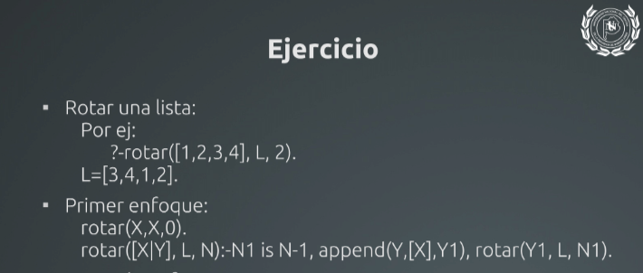
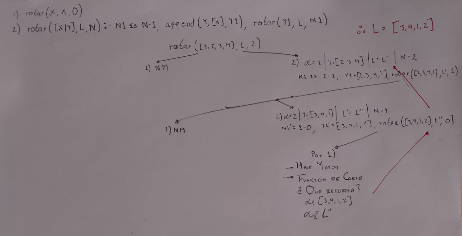

<em>DATE: JANUARY - JUNE 2024</em>

## **Activity, Meke a Tree about recursive function**

### Made In: ProLog

#### Activity number: 22

#### **DESCRIPTION:**

#### Make a desktop test in a tree, about a exercise when has a recursive functio to cala a route list

________________________________________________________
________________________________________________________

#### Student: José López Lara

#### Control Number: 19120194

* [x] Student Email: <l19120194@morelia.tecnm.mx>
* [x] Personal Email: <jose.lopez.lara.cto@gmail.com>
* [x] GitHub Profile: [JoseLopezLara](https://github.com/JoseLopezLara)
* [x] Linkedin Profile: [in/jose-lopez-lara/](https://www.linkedin.com/in/jose-lopez-lara/)

________________________________________________________
________________________________________________________

### **Genalogica Family Tree**

* **Exercise:**

* **Solution in tree:**

