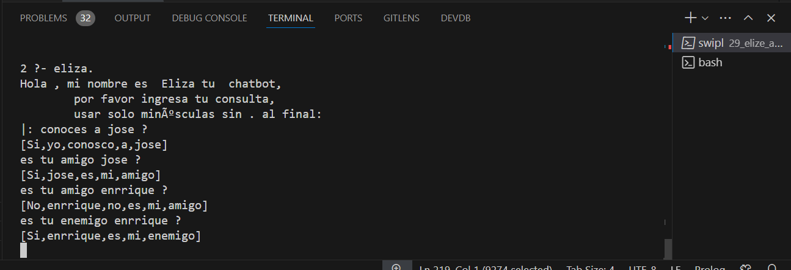

<p style="text-align: right;"><em>DATE: JANUARY - JUNE 2024</em></p>

## **Activity, Add new templates to Eliza of likes type**

### Made In: ProLog

#### Activity number: 29

#### **DESCRIPTION:**

#### I need add 3 new templates to elize code provider by teacher. This teamplates to need of likes type

________________________________________________________
________________________________________________________

#### Student: José López Lara

#### Control Number: 19120194

* [x] Student Email: <l19120194@morelia.tecnm.mx>
* [x] Personal Email: <jose.lopez.lara.cto@gmail.com>
* [x] GitHub Profile: [JoseLopezLara](https://github.com/JoseLopezLara)
* [x] Linkedin Profile: [in/jose-lopez-lara/](https://www.linkedin.com/in/jose-lopez-lara/)

________________________________________________________
________________________________________________________

### **Eliza**

* **New tampletes**

```ProLog
% ---- New templates using flags ----
% -----------------------------------
template([conoces, a, s(_), _], [flagKnow], [2]).
template([es, tu, amigo, s(_), _], [flagFriend], [3]).
template([es, tu, enemigo, s(_), _], [flagEnemy], [3]).

%elize know: flagKnow
elizaKnow(X, R):- know(X), R = ['Si', yo, conosco, a, X].
elizaKnow(X, R):- \+know(X), R = ['No', yo, conosco, a, X].
know(jose).
know(alejandro).
know(luis).
know(enrrique).

%elize know: flagFriend
elizaFriend(X, R):- friend(X), R = ['Si', X, es, mi, amigo].
elizaFriend(X, R):- \+friend(X), R = ['No', X, no, es, mi, amigo].
friend(jose).
friend(luis).

%elize know: flagEnemy
elizaEnemy(X, R):- enemy(X), R = ['Si', X, es, mi, enemigo].
elizaEnemy(X, R):- \+enemy(X), R = ['No', X, no, es, mi, enemigo].
enemy(alejandro).
enemy(enrrique).

% Eliza know:
replace0([I|_], Input, _, Resp, R):-
	nth0(I, Input, Atom),
	nth0(0, Resp, X),
	X == flagKnow,
	elizaKnow(Atom, R).

% Eliza friend:
replace0([I|_], Input, _, Resp, R):-
	nth0(I, Input, Atom),
	nth0(0, Resp, X),
	X == flagFriend,
	elizaFriend(Atom, R).

% Eliza enemy:
replace0([I|_], Input, _, Resp, R):-
	nth0(I, Input, Atom),
	nth0(0, Resp, X),
	X == flagEnemy,
	elizaEnemy(Atom, R).
```

**Test:**




* **All Eliza Code**

```ProLog
% Eliza know:
replace0([I|_], Input, _, Resp, R):-
	nth0(I, Input, Atom),
	nth0(0, Resp, X),
	X == flagKnow,
	elizaKnow(Atom, R).

% Eliza friend:
replace0([I|_], Input, _, Resp, R):-
	nth0(I, Input, Atom),
	nth0(0, Resp, X),
	X == flagFriend,
	elizaFriend(Atom, R).

% Eliza enemy:
replace0([I|_], Input, _, Resp, R):-
	nth0(I, Input, Atom),
	nth0(0, Resp, X),
	X == flagEnemy,
	elizaEnemy(Atom, R).
```
