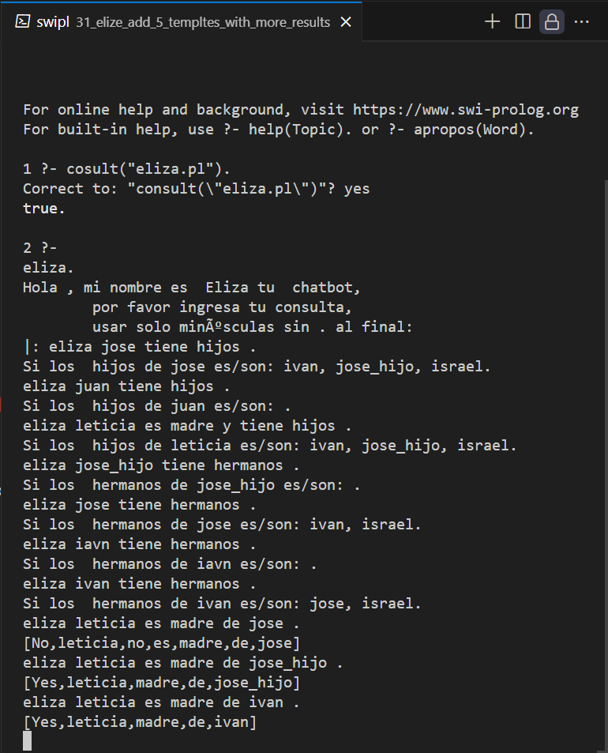

<p style="text-align: right;"><em>DATE: JANUARY - JUNE 2024</em></p>

## **Activity, Add new templates to Eliza of likes type with more results**

### Made In: ProLog

#### Activity number: 31

#### **DESCRIPTION:**

#### I need add 5 new templates to elize code provider by teacher. This teamplates to need of likes type but return more results

________________________________________________________
________________________________________________________

#### Student: José López Lara

#### Control Number: 19120194

* [x] Student Email: <l19120194@morelia.tecnm.mx>
* [x] Personal Email: <jose.lopez.lara.cto@gmail.com>
* [x] GitHub Profile: [JoseLopezLara](https://github.com/JoseLopezLara)
* [x] Linkedin Profile: [in/jose-lopez-lara/](https://www.linkedin.com/in/jose-lopez-lara/)

________________________________________________________
________________________________________________________

### **Eliza**

* **New tampletes**

```ProLog
% ---- New templates using multiple results ----
% ----------------------------------------------
template([eliza,  s(_), tiene, hijos, .], [flaghijosdepadre], [1]).
template([eliza,  s(_), es, madre, y, tiene, hijos, .], [flaghijosdemadre], [1]).
template([eliza,  s(_), tiene, hermanos, .], [flagbrother], [1]).
template([eliza, s(_), es, padre, de, s(_), .], [flagFather], [1,5]).
template([eliza, s(_), es, madre, de, s(_), .], [flagMother], [1,5]).

hijos_de_padre(X, R) :- 
    findall(Y, padre(X, Y), Hijos),
    atomic_list_concat(Hijos, ', ', HijosStr),
    format(atom(R), 'Si los  hijos de ~w es/son: ~w.', [X, HijosStr]).

hijos_de_madre(X, R) :- 
    findall(Y, madre(X, Y), Hijos),
    atomic_list_concat(Hijos, ', ', HijosStr),
    format(atom(R), 'Si los  hijos de ~w es/son: ~w.', [X, HijosStr]).

brothers(X, R) :- 
    findall(Y, hermano(X, Y), Hermanos),
    atomic_list_concat(Hermanos, ', ', HermanosStr),
    format(atom(R), 'Si los  hermanos de ~w es/son: ~w.', [X, HermanosStr]).	

madrede(X,Y,R):- madre(X, Y), R = ['Yes', X, madre, de, Y].
madrede(X,Y,R):- \+madre(X,Y), R = ['No', X, no, es, madre, de, Y].

padrede(X,Y,R):- padre(X, Y), R = ['Yes', X, padre, de, Y].
padrede(X,Y,R):- \+padre(X,Y), R = ['No', X, no, es, padre, de, Y].

% Elize know padre childrens
replace0([I|_], Input, _, Resp, R) :- 
    nth0(I, Input, Atom),
    nth0(0, Resp, X),
    X == flaghijosdepadre,
    hijos_de_padre(Atom, R).

% Elize know mother childrens
replace0([I|_], Input, _, Resp, R) :- 
    nth0(I, Input, Atom),
    nth0(0, Resp, X),
    X == flaghijosdemadre,
    hijos_de_madre(Atom, R).

% Elize know brothers
replace0([I|_], Input, _, Resp, R) :- 
    nth0(I, Input, Atom),
    nth0(0, Resp, X),
    X == flagbrother,
    brothers(Atom, R).

% Eliza father	
replace0([I, J], Input, _, Resp, R) :- 
    nth0(I, Input, Atom),
	nth0(J, Input, Atom1),
	nth0(0, Resp, X),
    X == flagFather,
    padrede(Atom, Atom1, R).

% Eliza mother
replace0([I, J], Input, _, Resp, R) :- 
    nth0(I, Input, Atom),
	nth0(J, Input, Atom1),
	nth0(0, Resp, X),
    X == flagMother,
    madrede(Atom, Atom1, R).

% ----- Knwoledge Base -----
padre(jose, ivan).         
padre(jose, jose_hijo).
padre(jose, israel). 

madre(leticia, ivan).         
madre(leticia, jose_hijo).
madre(leticia, israel).

hermano(jose, ivan).
hermano(jose, israel).
hermano(ivan, jose).
hermano(ivan, israel).
hermano(israel, ivan).
hermano(israel, jose).
```

**Test:**




* **All Eliza Code**

```ProLog

eliza:-	writeln('Hola , mi nombre es  Eliza tu  chatbot,
	por favor ingresa tu consulta,
	usar solo minúsculas sin . al final:'),
	readln(Input),
	eliza(Input),!.
eliza(Input):- Input == ['Adios'],
	writeln('Adios. espero poder verte ayudado.'), !.
eliza(Input):- Input == ['Adios', '.'],
	writeln('Adios. espero poder verte ayudado.'), !.
eliza(Input) :-
	template(Stim, Resp, IndStim),
	match(Stim, Input),
	% si he llegado aquí es que he
	% hallado el template correcto:
	replace0(IndStim, Input, 0, Resp, R),
	writeln(R),
	readln(Input1),
	eliza(Input1), !.

template([hola, mi, nombre, es, s(_), '.'], ['Hola', 0, 'Como', estas, tu, '?'], [4]).
template([buendia, mi, nombre, es, s(_), '.'], ['buen dia', 'Como', estas, tu, 0, '?'], [4]).
template([hola, ',', mi, nombre, es, s(_), '.'], ['Hola', 0, 'Como', estas, tu, '?'], [5]).
template([buendia, ',', mi, nombre, es, s(_), '.'], ['Buendia', 'Como', estas, tu, 0, '?'], [5]).
template([hola, _], ['Hola', 'como', estas, tu, '?'], []).
template([buendia, _], ['Buendia', 'Como', estas, tu, '?'], []).
template([yo, s(_), yo, soy, s(_),'.'], [por, que, 0, eres, 1, '?'], [1, 4]).
template([yo, s(_), tu, '.'], [why, do, you, 0, me ,'?'], [1]).
template([yo, soy, s(_),'.'], [porque, eres, tu, 0, '?'], [2]).

% New Templates
template([mi, cumple, es, el, _], ['Exelente', 'yo', no, cumplo, soy, una, maquina, ':C'], []).
template([cumplo, anos, el, _], ['Exelente', 'yo', no, cumplo, soy, una, maquina, ':C'], []).
template([el, _, es, mi, cumpleanos], ['Exelente', 'yo', no, cumplo, soy, una, maquina, ':C'], []).

template([mi, mejor, amigo, es, s(_), '!'], ['Exelente', gustaria, conocer, a, 0, '!'], [4]).
template([mi, amigo, favorito, es, s(_), '!'], ['Exelente', gustaria, conocer, a, 0, '!'], [4]).
template([s(_), es, mi, mejor, amigo, '!'], ['Exelente', gustaria, conocer, a, 0, '!'], [0]).

template([mi, amigo, s(_), es, una, gran, persona, '!'], ['Por', que, 0, te, cae, tan, bien, '?'], [2]).
template([mi, amigo, s(_), buena, persona, '!'], ['Por', que, 0, te, cae, tan, bien, '?'], [2]).
template([s(_), es, una, gran, persona, '!'], ['Por', que, 0, te, cae, tan, bien, '?'], [0]).


template([mi, amigo, s(_), tiene, gustos, similares, a, los, mios, '.'], ['Que', es, lo, que, mas, les, gusta, a, 0, y, a, ti, '?'], [2]).
template([s(_), tiene, gustos, similares, a, los, mios, '.'], ['Que', es, lo, que, mas, les, gusta, a, 0, y, a, ti, '?'], [0]).
template([s(_), y, yo, tenemos, gustos, similares, '.'], ['Que', es, lo, que, mas, les, gusta, a, 0, y, a, ti, '?'], [0]).

template([tengo, otro, amigo, que, se, llama, s(_), '.'], ['Un', gusto, saber, que, 0, es, tu, amigo, '¿', tines, mas, amigos, '?'], [6]).
template([mi, otro, amigo, se, llama, s(_), '.'], ['Un', gusto, saber, que, 0, es, tu, amigo, '¿', tines, mas, amigos, '?'], [5]).
template([tengo, otro, es, s(_), '.'], ['Un', gusto, saber, que, 0, es, tu, amigo, '¿', tines, mas, amigos, '?'], [3]).

template([si, tengo, alrededor, de, s(_), amigos, '.'], ['WOW!', 0, son, bastante, '¿', quien, es, tu, amigo, favorito, '?'], [4]).
template([claro, tengo, alrededor, de, s(_), amigos, '.'], ['WOW!', 0, son, bastante, '¿', quien, es, tu, amigo, favorito, '?'], [4]).
template([tengo, s(_), mas, '.'], ['WOW!', 0, son, bastante, '¿', quien, es, tu, amigo, favorito, '?'], [1]).

template([_, es, mi, amigo, favorito, '.'], ['Me', gustaria, no, ser, una, maquina, y, tener, amigos, ':C'], []).
template([mi, amigo, favorito, es, _, '.'], ['Me', gustaria, no, ser, una, maquina, y, tener, amigos, ':C'], []).
template([mi, mejor, amigo, es, _, '.'], ['Me', gustaria, no, ser, una, maquina, y, tener, amigos, ':C'], []).

% Templates with two arguments
template([mis, 2, mejores, amigos, son, s(_), y, s(_), '.'], ['Exelente!', algun, dia, me, gustaria, conocer, a, 0, y, a, 1, ',', '¿', tienes, amigas, '?'], [5,7]).
template([mis, 2, mejores, amigas, son, s(_), y, s(_), '.'], ['Exelente!', algun, dia, me, gustaria, conocer, a, 0, y, a, 1, '!'], [5,7]).
template([mis, 2, primos, preferidos, son, s(_), y, s(_), '.'], ['Exelente!', algun, dia, me, gustaria, conocer, a, 0, y, a, 1, ',', '¿', tienes, prima, '?'], [5,7]).
template([mis, 2, primas, preferidas, son, s(_), y, s(_), '.'], ['Exelente!', algun, dia, me, gustaria, conocer, a, 0, y, a, 1, '!'], [5,7]).
template([tambien, tengo, tengo, un, perro, llamado, s(_), y, una, perrita, llamada, s(_), '.'], ['Quie', es, mayor, ', ', '¿', 0, o, 1, '?'], [6,11]).

% Templates with three arguments
template([me, gusta, practicar, s(_), con, s(_), y, s(_), '.'], ['Genial!', 1, y, 2, son, buenos, practicando, 0, '?'], [3,5,7]).
template([s(_), es, un, deporte, que, disfruto, practicar, con, s(_), y, s(_), '.'], ['¡Genial!', ', ', 1, y, 2, son, buenos, practicando, 0, '?'], [0,8,10]).
template([el, s(_), ', ', s(_), y, el, s(_), son, mis, deportes, favoritos, '.'], ['Eenial!', '¿', el, 0, ', ', 1, y, 2, son, deportes, bastante, populares, '!'], [1,3,6]).
template([s(_), es, un, deporte, muy, popular, entre, s(_), y, s(_), en, mi, ciudad, '.'], ['¡Interesante!', '¿Has, equipos, mixtos, entr', 1, y, 2, de, 0, en, tu, ciudad, '?'], [0,7,9]).
template([s(_), es, un, deporte, muy, conocido, entre, s(_), y, s(_), en, mi, ciudad, '.'], ['¡Interesante!', '¿Has, equipos, mixtos, entr', 1, y, 2, de, 0, en, tu, ciudad, '?'], [0,7,9]).

% pregunta algo que le gusta a eliza
template([te, gustan, las, s(_), _], [flagLike], [3]).
template([te, gustan, los, s(_), _], [flagLike], [3]).

		 % pregunta algo que hace eliza
template([tu, eres, s(_), _], [flagDo], [2]).
% pregunta algo que es eliza
template([que, eres, tu, s(_)], [flagIs], [2]).
template([eres, s(_), '?'], [flagIs], [2]).

% ---- New templates using flags ----
% -----------------------------------
template([conoces, a, s(_), _], [flagKnow], [2]).
template([es, tu, amigo, s(_), _], [flagFriend], [3]).
template([es, tu, enemigo, s(_), _], [flagEnemy], [3]).

template([como, estas, tu, '?'], [yo, estoy, bien, ',', gracias, por, preguntar, '.'], []).

template([yo, pienso, que, _], [bueno, esa, es, tu, opinion], []).
template([porque, _], [esa, no, es, una, buena, razon, '.'], []).
template([i, have, s(_), with, s(_), '.'], ['You', have, to, deal, with, your, 0, and, your, 1, in, a, mature, way, '.'], [2, 4]).
template([i, s(_),  _], [i, can, recommend, you, a, book, about, that, issue], []).
template([please, s(_), _], ['No', i, can, not, help, ',', i, am, just, a, machine], []). 
		 template([tell, me, a, s(_), _], ['No', i, can, not, ',', i, am, bad, at, that], []).

% ---- New templates using multiple results ----
% ----------------------------------------------
template([eliza,  s(_), tiene, hijos, .], [flaghijosdepadre], [1]).
template([eliza,  s(_), es, madre, y, tiene, hijos, .], [flaghijosdemadre], [1]).
template([eliza,  s(_), tiene, hermanos, .], [flagbrother], [1]).
template([eliza, s(_), es, padre, de, s(_), .], [flagFather], [1,5]).
template([eliza, s(_), es, madre, de, s(_), .], [flagMother], [1,5]).

				  
template(_, ['Please', explain, a, little, more, '.'], []). 
% Lo que le gusta a eliza : flagLike
elizaLikes(X, R):- likes(X), R = ['Yeah', i, like, X].
elizaLikes(X, R):- \+likes(X), R = ['Nope', i, do, not, like, X].
likes(apples).
likes(ponies).
likes(zombies).
likes(manzanas).
likes(computadoras).
like(carros).


% lo que hace eliza: flagDo
elizaDoes(X, R):- does(X), R = ['Yes', i, X, and, i, love, it].
elizaDoes(X, R):- \+does(X), R = ['No', i, do, not, X ,'.', it, is, too, hard, for, me].
does(study).
does(cook).
does(work).

% lo que es eliza: flagIs
elizaIs(X, R):- is0(X), R = ['Yes', yo, soy, X].
elizaIs(X, R):- \+is0(X), R = ['No', i, am, not, X].
is0(dumb).
is0(weird).
is0(nice).
is0(fine).
is0(happy).
is0(redundant).

%elize know: flagKnow
elizaKnow(X, R):- know(X), R = ['Si', yo, conosco, a, X].
elizaKnow(X, R):- \+know(X), R = ['No', yo, conosco, a, X].
know(jose).
know(alejandro).
know(luis).
know(enrrique).

%elize know: flagFriend
elizaFriend(X, R):- friend(X), R = ['Si', X, es, mi, amigo].
elizaFriend(X, R):- \+friend(X), R = ['No', X, no, es, mi, amigo].
friend(jose).
friend(luis).

%elize know: flagEnemy
elizaEnemy(X, R):- enemy(X), R = ['Si', X, es, mi, enemigo].
elizaEnemy(X, R):- \+enemy(X), R = ['No', X, no, es, mi, enemigo].
enemy(alejandro).
enemy(enrrique).

hijos_de_padre(X, R) :- 
    findall(Y, padre(X, Y), Hijos),
    atomic_list_concat(Hijos, ', ', HijosStr),
    format(atom(R), 'Si los  hijos de ~w es/son: ~w.', [X, HijosStr]).

hijos_de_madre(X, R) :- 
    findall(Y, madre(X, Y), Hijos),
    atomic_list_concat(Hijos, ', ', HijosStr),
    format(atom(R), 'Si los  hijos de ~w es/son: ~w.', [X, HijosStr]).

brothers(X, R) :- 
    findall(Y, hermano(X, Y), Hermanos),
    atomic_list_concat(Hermanos, ', ', HermanosStr),
    format(atom(R), 'Si los  hermanos de ~w es/son: ~w.', [X, HermanosStr]).	

madrede(X,Y,R):- madre(X, Y), R = ['Yes', X, madre, de, Y].
madrede(X,Y,R):- \+madre(X,Y), R = ['No', X, no, es, madre, de, Y].

padrede(X,Y,R):- padre(X, Y), R = ['Yes', X, padre, de, Y].
padrede(X,Y,R):- \+padre(X,Y), R = ['No', X, no, es, padre, de, Y].

match([],[]).
match([], _):- true.

match([S|Stim],[I|Input]) :-
	atom(S), % si I es un s(X) devuelve falso
	S == I,
	match(Stim, Input),!.

match([S|Stim],[_|Input]) :-
% I es un s(X), lo ignoro y continúo con el resto de la lista
	\+atom(S),
	match(Stim, Input),!.

replace0([], _, _, Resp, R):- append(Resp, [], R),!.

% Eliza likes:
replace0([I|_], Input, _, Resp, R):-
	nth0(I, Input, Atom),
	nth0(0, Resp, X),
	X == flagLike,
	elizaLikes(Atom, R).

% Eliza does:
replace0([I|_], Input, _, Resp, R):-
	nth0(I, Input, Atom),
	nth0(0, Resp, X),
	X == flagDo,
	elizaDoes(Atom, R).

% Eliza is:
replace0([I|_], Input, _, Resp, R):-
	nth0(I, Input, Atom),
	nth0(0, Resp, X),
	X == flagIs,
	elizaIs(Atom, R).

% Eliza know:
replace0([I|_], Input, _, Resp, R):-
	nth0(I, Input, Atom),
	nth0(0, Resp, X),
	X == flagKnow,
	elizaKnow(Atom, R).

% Eliza friend:
replace0([I|_], Input, _, Resp, R):-
	nth0(I, Input, Atom),
	nth0(0, Resp, X),
	X == flagFriend,
	elizaFriend(Atom, R).

% Eliza enemy:
replace0([I|_], Input, _, Resp, R):-
	nth0(I, Input, Atom),
	nth0(0, Resp, X),
	X == flagEnemy,
	elizaEnemy(Atom, R).

% Elize know padre childrens
replace0([I|_], Input, _, Resp, R) :- 
    nth0(I, Input, Atom),
    nth0(0, Resp, X),
    X == flaghijosdepadre,
    hijos_de_padre(Atom, R).

% Elize know mother childrens
replace0([I|_], Input, _, Resp, R) :- 
    nth0(I, Input, Atom),
    nth0(0, Resp, X),
    X == flaghijosdemadre,
    hijos_de_madre(Atom, R).

% Elize know brothers
replace0([I|_], Input, _, Resp, R) :- 
    nth0(I, Input, Atom),
    nth0(0, Resp, X),
    X == flagbrother,
    brothers(Atom, R).

% Eliza father	
replace0([I, J], Input, _, Resp, R) :- 
    nth0(I, Input, Atom),
	nth0(J, Input, Atom1),
	nth0(0, Resp, X),
    X == flagFather,
    padrede(Atom, Atom1, R).

% Eliza mother
replace0([I, J], Input, _, Resp, R) :- 
    nth0(I, Input, Atom),
	nth0(J, Input, Atom1),
	nth0(0, Resp, X),
    X == flagMother,
    madrede(Atom, Atom1, R).

replace0([I|_], Input, _, Resp, R) :- 
    nth0(I, Input, Atom),
    nth0(0, Resp, X),
    X == flagfam,
    familia(Atom, R).

replace0([I|Index], Input, N, Resp, R):-
	length(Index, M), M =:= 0,
	nth0(I, Input, Atom),
	select(N, Resp, Atom, R1), append(R1, [], R),!.

replace0([I|Index], Input, N, Resp, R):-
	nth0(I, Input, Atom),
	length(Index, M), M > 0,
	select(N, Resp, Atom, R1),
	N1 is N + 1,
	replace0(Index, Input, N1, R1, R),!.


% ----- Knwoledge Base -----
padre(jose, ivan).         
padre(jose, jose_hijo).
padre(jose, israel). 

madre(leticia, ivan).         
madre(leticia, jose_hijo).
madre(leticia, israel).

hermano(jose, ivan).
hermano(jose, israel).
hermano(ivan, jose).
hermano(ivan, israel).
hermano(israel, ivan).
hermano(israel, jose).
```
