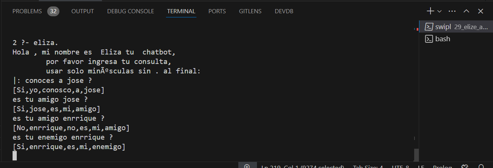

<p style="text-align: right;"><em>DATE: JANUARY - JUNE 2024</em></p>

## **Activity, Add new templates to Eliza of likes type with more results**

### Made In: ProLog

#### Activity number: 31

#### **DESCRIPTION:**

#### I need add 5 new templates to elize code provider by teacher. This teamplates to need of likes type but return more results

________________________________________________________
________________________________________________________

#### Student: José López Lara

#### Control Number: 19120194

* [x] Student Email: <l19120194@morelia.tecnm.mx>
* [x] Personal Email: <jose.lopez.lara.cto@gmail.com>
* [x] GitHub Profile: [JoseLopezLara](https://github.com/JoseLopezLara)
* [x] Linkedin Profile: [in/jose-lopez-lara/](https://www.linkedin.com/in/jose-lopez-lara/)

________________________________________________________
________________________________________________________

### **Eliza**

* **New tampletes**

```ProLog
```

**Test:**




* **All Eliza Code**

```ProLog

```
